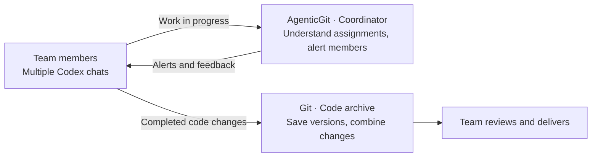
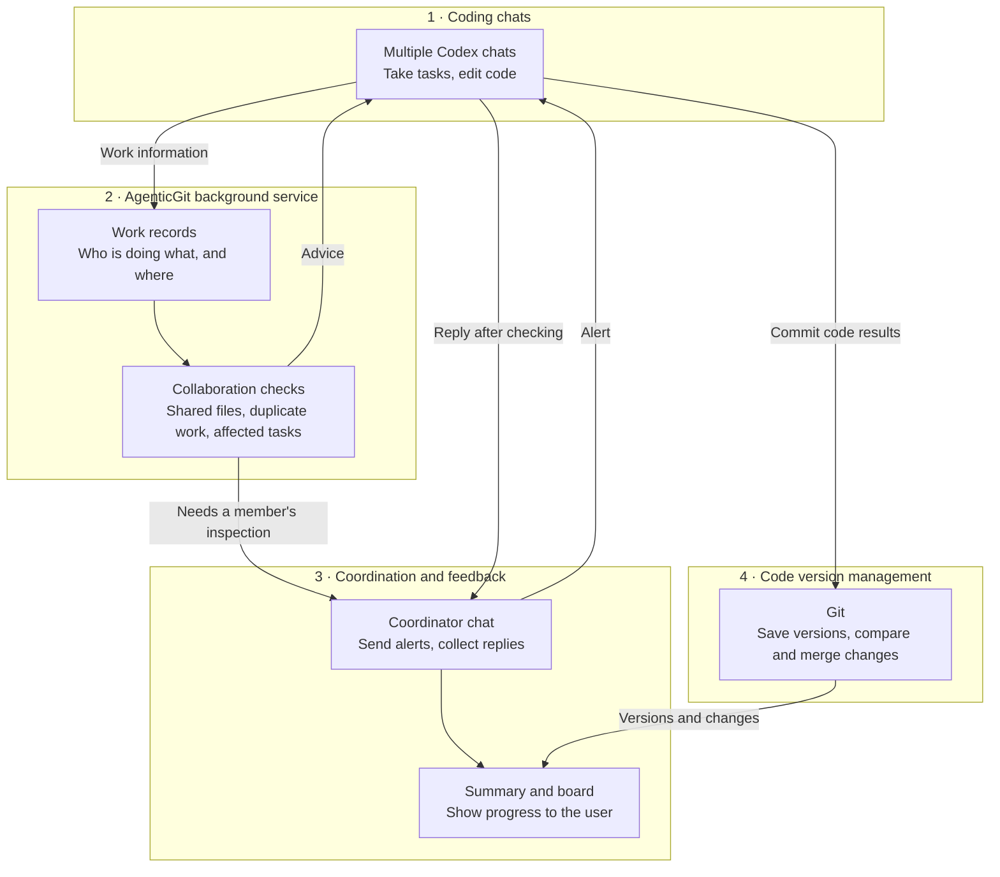
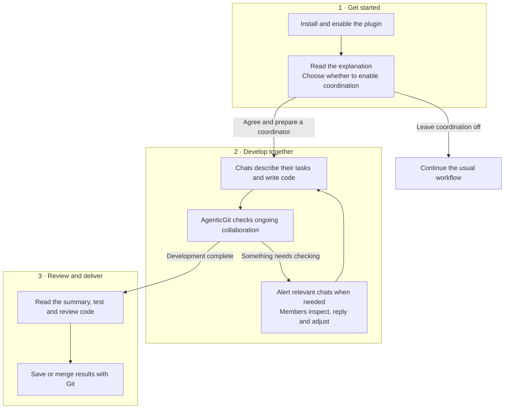

# AgenticGit

**English** | [简体中文](README.zh-cn.md)

**Help multiple Codex chats understand each other's work while coding together.**

Several chats working on one project may edit the same file, build the same feature twice, or change an interface another chat is using. AgenticGit records their work, flags situations worth checking, and, with your permission, asks the relevant chats to inspect them and collects their replies.

Git saves code versions, compares changes and combines the results. AgenticGit helps with assignments and communication during development. Together, they connect parallel work with a reviewed delivery.

## Think of a company or research team

Each Codex chat is a colleague or lab member working on an assigned task. AgenticGit acts as a coordinator who watches for overlapping work and changes that need discussion. Git is the team's code archive, keeping versions and helping combine everyone's changes.



### How do AgenticGit and Git differ, and work together?

| Team situation | What Git does | What AgenticGit does | How they work together |
| --- | --- | --- | --- |
| Find out what everyone is working on | Shows recorded code changes and commits | Summarizes registered tasks and work areas | Check assignments during development and code results at delivery |
| Two members edit the same file | Compares changes; merging versions may reveal text conflicts | Asks affected chats to check their scope and agree on an order | Coordinate early, then inspect and merge actual changes |
| Two members build the same feature with different names | Saves both implementations; does not judge duplicate effort | Flags possible duplication using task descriptions and supported code structure checks | Members decide what to reuse, then save the result with Git |
| One member changes an interface another still uses | Records the interface code change | Uses registered dependencies to alert affected chats | Adapt the related code, test it and commit |
| Explain why something changed and who checked it | Shows code differences and commit messages | Keeps work records, inspection requests and replies | Connect code changes with the collaboration behind them |
| Undo changes or combine the results | Supports version recovery, branches and merges | Provides coordination information and advice | The team decides, then uses Git for version operations |

For example, two members implement order totals in different files using different function names. Git can save both implementations. When AgenticGit detects similar work, it asks the members whether both are needed. The team decides what to keep or share, tests it and commits the result.

AgenticGit supplies evidence to check; members still decide. Git's version history and merge tools remain the foundation for delivery.

## System architecture

Four parts form the system: coding chats supply work information, AgenticGit records and checks it, a coordinator handles alerts and replies, and Git saves the code results.



The background service identifies situations worth checking. After you authorize it, the coordinator contacts other chats and collects their actual replies. See the [architecture reference](docs/ARCHITECTURE.md) for implementation details.

## Plugin workflow



The first offer is per workspace, usually at a new session or the start of work. Opening a file alone does not guarantee a popup. Automatic cross-chat alerts require your explicit consent and can be disabled at any time.

## Get started

Requires Node 22.19+ and Codex with local plugin support. Install from source:

```sh
git clone https://github.com/yiweiqin/agentgit.git
cd agentgit
npm ci
node packages/cli/bin/agentgit.mjs install
codex plugin add agentgit@personal
node packages/cli/bin/agentgit.mjs install --enable
```

Replace `personal` with the marketplace name printed by the installer. Enable the plugin and trust its hooks in Codex, start a new chat, and follow the explanation to choose whether to enable automatic coordination. Keep the source checkout: the plugin uses it at runtime.

Collaboration checks work in ordinary folders too; version history and merges require Git. See the [usage guide](docs/USAGE.md) for installation checks and troubleshooting.

## Learn more

Two-chat walkthroughs have verified alerts and replies for shared-file work and JS/TS implementations with different names but identical normalized structure. Similar-work detection has language and syntax limits. Alerts need inspection and do not replace testing or code review.

- [Installation, automatic alerts, commands and limitations](docs/USAGE.md)
- [System architecture and implementation](docs/ARCHITECTURE.md)
- [How changes affect other chats](docs/CROSS-SESSION-IMPACT.md)
- [Experiments and validation](docs/EXPERIMENTS.md)
- [Documentation index / 文档目录](docs/INDEX.md)

MIT license.

## Structured Delta research prototype

A standalone Python implementation and reproduction guide are available in
[prototypes/structured-delta](prototypes/structured-delta/README.md).
See [scope and evidence](docs/STRUCTURED-DELTA.md); this prototype is separate
from the product runtime, and generated experimental artifacts stay local.
