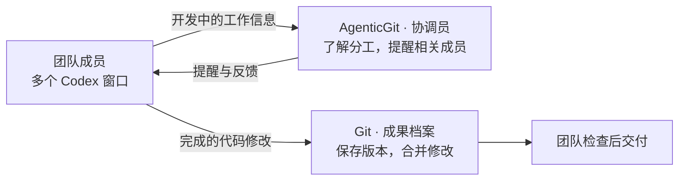
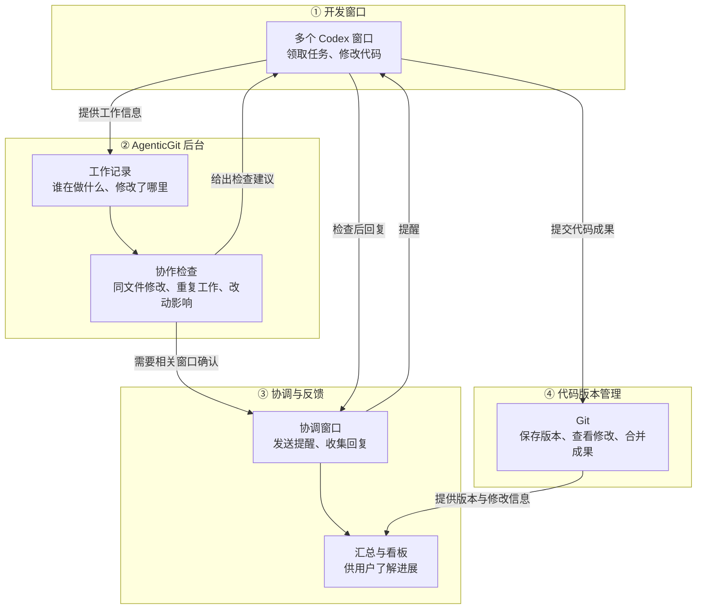
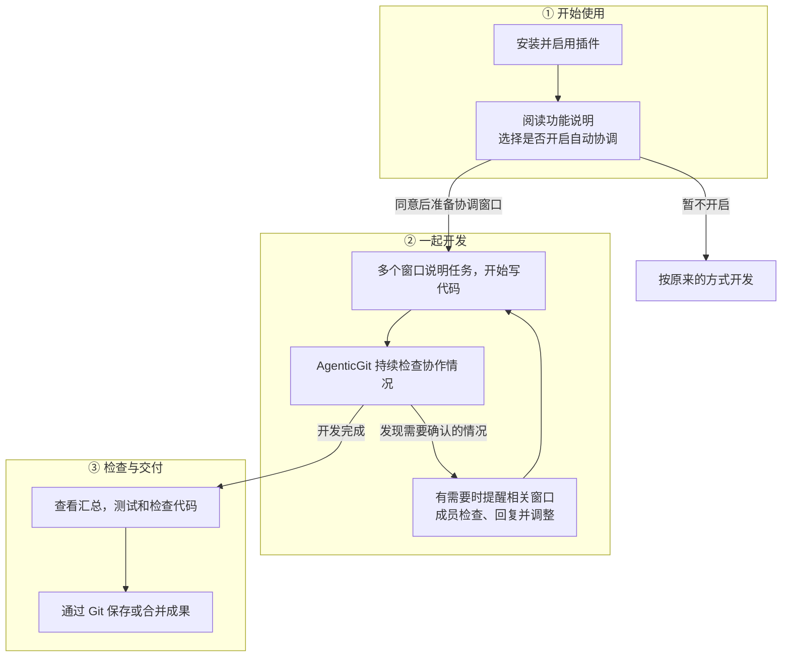

# AgenticGit

[English](README.md) | **简体中文**

**让多个 Codex 窗口一起写代码时，知道彼此在做什么。**

当几个窗口同时开发一个项目，可能会改到同一份文件、重复实现同一个功能，或者改动其他窗口正在使用的接口。AgenticGit 记录各窗口的工作，发现这些情况后提醒相关窗口检查，并把回复汇总给你。

Git 负责保存代码版本、比较修改和合并成果；AgenticGit 负责开发过程中的分工与提醒。两者配合，让团队从并行开发到最终交付都有据可查。

## 用公司或实验室的团队协作来理解

把每个 Codex 窗口看作一位同事或研究成员：你安排任务，大家分别开发。AgenticGit 像协调员，留意有没有撞车、重复劳动或需要互相确认的改动；Git 像成果档案，保存代码的各个版本，并支持把大家的修改合到一起。



### AgenticGit 和 Git 有什么区别，怎样配合？

| 团队遇到的事情 | Git 能做什么 | AgenticGit 能做什么 | 两者怎样配合 |
| --- | --- | --- | --- |
| 想知道大家正在做什么 | 查看已经记录的代码修改与提交 | 汇总各窗口登记的任务和工作范围 | 开发中看分工，交付时看代码成果 |
| 两位成员改了同一份文件 | 比较修改；合并不同版本时发现文本冲突 | 提醒相关窗口确认修改范围，商量先后顺序 | 提前协调，再检查和合并实际修改 |
| 两位成员做了同一个功能，但起的名字不同 | 保存两份实现；不判断是否重复劳动 | 根据任务描述和支持的代码结构检查提示可能重复 | 成员确认后决定复用哪份，再用 Git 保存结果 |
| 一位成员改了接口，另一位还按旧接口开发 | 记录接口代码的变化 | 根据已登记的使用关系，提醒可能受影响的窗口 | 先调整相关代码，再测试并提交 |
| 想回看“为什么改、谁确认过” | 查看代码差异和提交说明 | 查看工作记录、检查提醒及相关窗口的回复 | 把代码变化与协作过程对应起来 |
| 想撤回修改或合并成果 | 支持恢复版本、分支和合并 | 提供协调信息与检查建议 | 团队作出决定后，通过 Git 执行版本操作 |

例如，公司安排 A、B 两位成员开发订单统计。A 在一个文件里写了求和函数，B 在另一个文件里写了逻辑相同、名字不同的函数。Git 可以正常保存这两份代码；AgenticGit 会在检测到相似工作时提醒两人确认是否需要重复实现。团队决定保留或共用哪份代码后，再测试并通过 Git 提交。

AgenticGit 提供的是检查线索，仍需要成员确认；Git 的版本记录和合并能力仍是团队交付的基础。

## 系统架构

整个系统分为四部分：开发窗口提供工作信息，AgenticGit 记录并检查，协调窗口传递提醒与反馈，Git 保存代码成果。



后台负责发现需要检查的情况；获得你的授权后，协调窗口负责通知其他窗口，并收集它们的实际回复。具体组件和数据处理过程见 [系统架构说明](docs/ARCHITECTURE.zh-cn.md)。

## 插件使用流程



首次开启询问以项目工作区为单位，通常在新会话或开始工作时触发。当前不能保证每次打开文件都会出现弹窗。自动跨窗口提醒需要你明确同意，随时可以关闭。

## 开始使用

需要 Node 22.19+ 和支持本地插件的 Codex。源码安装：

```sh
git clone https://github.com/yiweiqin/agentgit.git
cd agentgit
npm ci
node packages/cli/bin/agentgit.mjs install
codex plugin add agentgit@personal
node packages/cli/bin/agentgit.mjs install --enable
```

`personal` 使用安装器输出的名称。在 Codex 中启用并信任插件钩子，开始新会话，再按照功能说明选择是否开启自动协调。保留源码目录，运行时会使用它。

普通文件夹也可以进行协作检查；保存版本和合并成果需要 Git。安装检查和常见问题见 [安装与自动检查说明](docs/USAGE.zh-cn.md)。

## 进一步了解

当前已验证两个窗口修改同文件，以及两个窗口编写名称不同但结构相同的 JS/TS 代码时的提醒与回复链路。相似功能检查有语言和代码形式限制，提醒仍需人工确认，也不能替代测试与代码评审。

- [安装、自动提醒、日常操作与检测范围](docs/USAGE.zh-cn.md)
- [系统架构与实现细节](docs/ARCHITECTURE.zh-cn.md)
- [改动如何影响其他窗口](docs/CROSS-SESSION-IMPACT.zh-cn.md)
- [实验与验证方法](docs/EXPERIMENTS.zh-cn.md)

[完整文档目录](docs/INDEX.md)

MIT 许可。

## 结构化 Delta 研究原型

独立 Python 实现、测试和复现入口见
[prototypes/structured-delta](prototypes/structured-delta/README.md)。
[方案范围与证据](docs/STRUCTURED-DELTA.md)说明现有结果及限制；
原型尚未接入产品运行流程，生成的实验数据与结果保留在本地。
