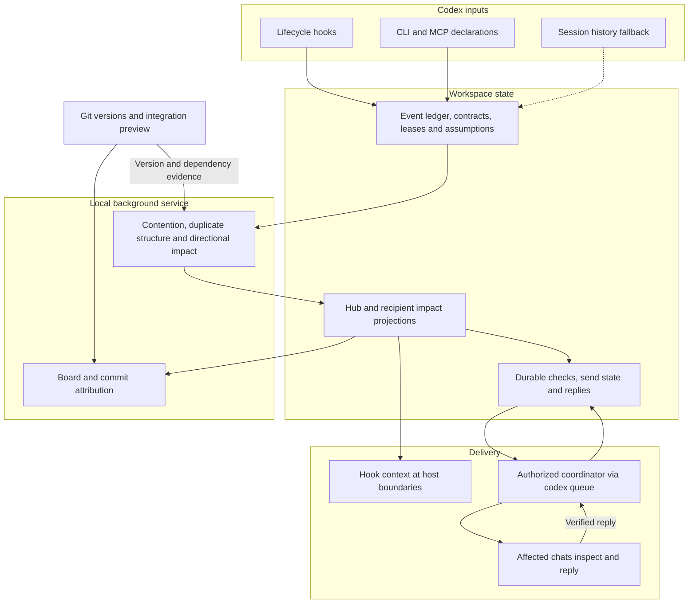

# AgenticGit architecture

[简体中文](ARCHITECTURE.zh-cn.md) · [Documentation index](INDEX.md) · [Usage](USAGE.md)

The README shows the major modules. This reference explains collection, state, detection, delivery and Git integration in the current implementation.

## Implementation flow

## Components and source locations

| Responsibility | Source |
| --- | --- |
| Lifecycle routing | [hook.mjs](../plugins/agentgit/scripts/hook.mjs) |
| Record tool activity | [track.mjs](../plugins/agentgit/scripts/track.mjs) |
| Offer workspace setup | [desktop.mjs](../plugins/agentgit/scripts/desktop.mjs), [desktop.ts](../packages/core/src/desktop.ts) |
| Start or reuse the service | [spine.mjs](../plugins/agentgit/scripts/spine.mjs), [endpoint.ts](../packages/daemon/src/endpoint.ts) |
| Watch state and serve local HTTP | [serve.ts](../packages/daemon/src/serve.ts) |
| Shared-work advice | [hub.ts](../packages/core/src/hub.ts) |
| Rename-insensitive source comparison | [code-duplicates.ts](../packages/core/src/code-duplicates.ts) |
| Directional impacts and state | [impact.ts](../packages/core/src/impact.ts), [impact-state.ts](../packages/core/src/impact-state.ts) |
| Mechanical module dependencies | [modules.ts](../packages/core/src/modules.ts) |
| Deliver cached context | [hub.mjs](../plugins/agentgit/scripts/hub.mjs) |
| Durable inspection jobs | [checks.ts](../packages/core/src/checks.ts) |
| Wake the coordinator | [daemon checks.ts](../packages/daemon/src/checks.ts) |
| CLI and MCP interfaces | [CLI](../packages/cli/src/main.ts), [MCP](../packages/mcp/src/main.ts) |

Local rules do not call a model. Coordinator work and participant inspections do. Detection itself grants no authority to edit business code or merge results.

## Collection and hook boundaries

Preflight declarations supply intent, path and known symbol before a write. Contracts and impact declarations supply dependency and version evidence. Trusted hooks supplement these facts:

| Event | Steps |
| --- | --- |
| `SessionStart`, `UserPromptSubmit` | Record → ensure service → deliver advice → consider setup offer |
| `PreToolUse` | Record; deliver relevant advice for recognized write tools |
| `PostToolUse` | Record → deliver updates → consider offer after completed writes |
| `Stop` | Record |

Write recognition depends on tool names and extractable paths. Shell commands may not expose their write scope in advance. Session history adoption is a fallback for completed actions; it is not pre-write protection. There is no native file-open event. Offers are instructions for the agent and host UI, not OS popups.

## State and persistence

All workspace state is under `.agentgit/`:

| Location | Contents |
| --- | --- |
| `config.json` | Workspace settings and experimental arm |
| `events/<machine>-<date>.jsonl` | Append-only coordination facts |
| `contracts/index.json` | Shared interface versions |
| `state/leases.json`, `state/assumptions.json` | Derived leases and version assumptions |
| `state/desktop.json` | Coordinator identity and enablement bookkeeping |
| `state/daemon.json` | Actual local PID, port and root |
| `state/hub.json` | Current shared advice |
| `state/impact-protocol.json`, `impact-inbox/`, `impact-seen/` | Selective delivery marker, recipient views and display receipts |
| `state/checks.json`, `state/receipts/` | Durable authorization, jobs, sending state and inspection evidence |

Derived views support bounded reads. The checks queue and inspection evidence are durable state, not disposable caches. Unclaimed workspace offers and refusals are stored outside the workspace in `~/.agentgit/offers.json`. Machine paths and chat IDs are not portable setup data.

## Detection and limits

Shared-file checks combine recent declarations across file and symbol keys. They identify overlapping work, not proof of a text conflict. The queue's recent declaration window is ten minutes. Hub rulings also consider entities, live leases, intent and contracts. An `ambiguous` ruling can be answered using `agentgit_hub_resolve`; the earliest valid answer for the same contention remains the conclusion.

Duplicate work uses lexical intent similarity and a separate file-level source fingerprint. The fingerprint normalizes identifier spelling while retaining literals, operators, member names and identifier relationships. It is bounded evidence rather than general semantic equivalence analysis:

- Recent open tasks: proposed, active or validated, active within one hour; at most 60 tasks.
- At most 8 declared files per task; `.ts`, `.tsx`, `.js`, `.jsx`, `.mjs`, `.cjs` only.
- At most 128,000 bytes per file, a 2,000,000-byte read budget and 5 candidate pairs.
- Between 40 and 20,000 tokens, with at least 3 normalized identifiers.
- Templates and unresolved slash syntax are skipped. Different tasks must refer to different files within the workspace.

Directional impact compares changes against the recipient's entities, dependencies, contract assumptions, artifacts and module relationships. Generic writes do not prove breaking interface changes. Mechanical import evidence can narrow routing, but a module relationship alone does not trigger an urgent interrupt. Full rules are in [cross-session impact](CROSS-SESSION-IMPACT.md).

## Two delivery paths

Hooks read published views and inject advice at host event boundaries. With the selective impact protocol active, they read recipient inboxes rather than broadcast all advice. This does not terminate tools or lock files.

Opt-in cross-chat checks persist jobs and wake one configured coordinator through `codex queue`. With selective impact active, the queue retains urgent directional impacts, evidence-backed shared-file contention and source-structure duplicates; lexical overlap alone does not add cross-chat jobs. The coordinator verifies the target's workspace, reserves a token, sends a check, and records a final reply matching its ID, target and timing. See [coordinate.md](../plugins/agentgit/skills/agentgit/references/coordinate.md).

States normally progress `pending → reserved → sent → replied`; exceptions are `failed`, `timed_out` and `cancelled`. Reserved/sent jobs time out after ten minutes, and verified late replies remain acceptable. Reservations prevent duplicate participant sends after interruption. Wake failures have bounded retry and backoff; unchanged work does not cause a constant status feed. Windows file replacement uses bounded retry rather than deleting the original state file.

The service polls every two seconds by default, refreshes unchanged projections about every five seconds, and adopts history every fifteen seconds. These are processing intervals, not end-to-end message latency promises. Automatically started services select an available local port; read the actual endpoint file.

## Git integration and design choices

Ordinary folders support coordination. Git repositories additionally support task branches, isolated worktrees, path-scoped checkpoints, provenance and integration previews. Path scoping keeps unrelated files out of checkpoints; it cannot separate two people's edits inside one shared file.

Checkpoint trailers record `AgenticGit-Task` and `AgenticGit-Session`. Attribution can fall back to task branches, ledger mappings, recorded chat names, identifiers or Git authors. Fallback evidence must remain distinguishable from a recorded assignment. Existing commits are not rewritten to fabricate attribution.

`reconcile` can use `git merge-tree` for a preview. That may write Git objects but does not move branches or edit the worktree. Text that merges cleanly is not proof of correct behavior. The plugin does not automatically merge, rebase, reset, clean or push; actual integration remains the team's decision.

The design keeps durable facts separate from derived views, places inexpensive deterministic checks outside chat context, and uses models for inspection and explanation after permission. It favors advisory results with reasons over enforced write blocking. Experimental measurements and their controls are documented separately from product claims in [experiments](EXPERIMENTS.md).
