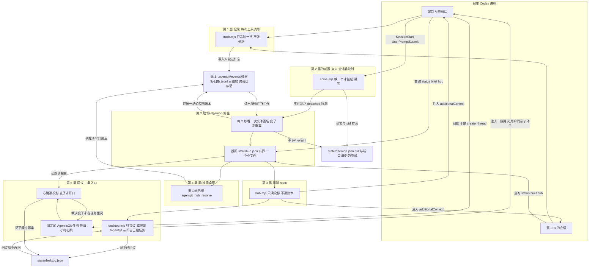
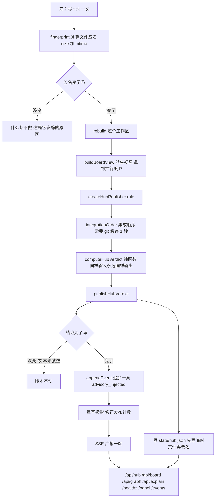
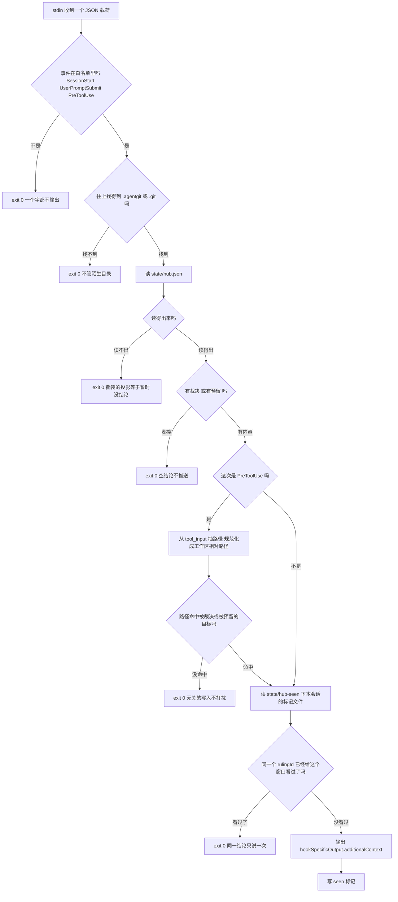
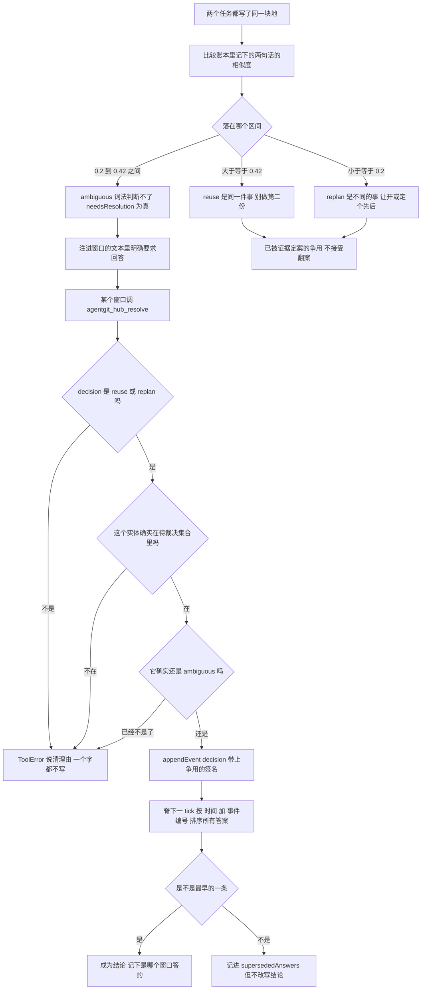
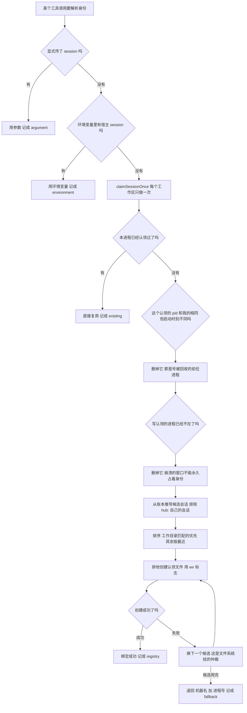
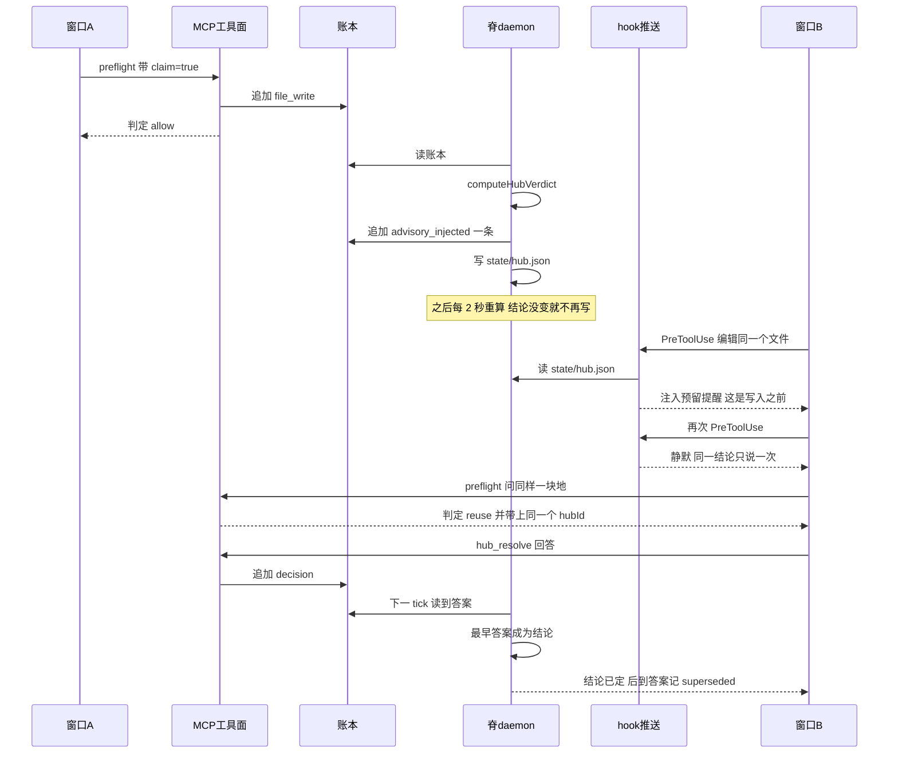
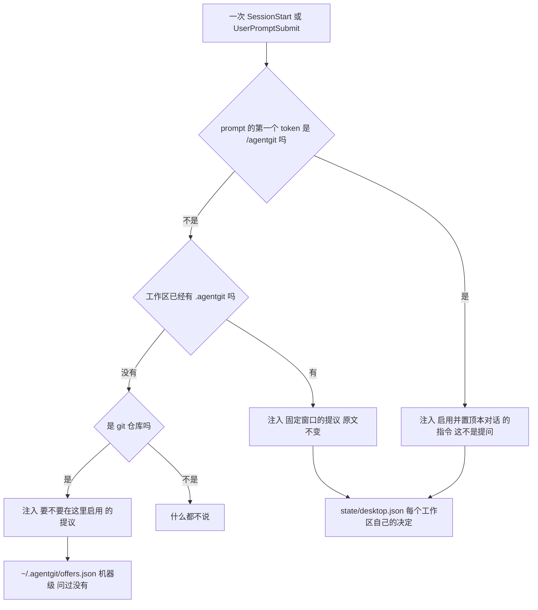

# 系统链路图：中枢是怎么工作的

这篇文档只有一件事要说清楚：**一个工作区里并行跑着好几个窗口，它们凭什么拿到同一个结论，
以及这个结论是怎么送到每个窗口面前的。**

每张图旁边配一个比喻。比喻不是装饰，是因为这套东西的分工靠一句话说不清——
四层各自读写**不同的**数据源，混起来想就会得出"每次工具调用都在读全量账本"这种错误结论。

图里画的是**已经落地并跑通**的链路（797 条测试 + 一个双窗口实跑演示），不是设想。
每一节末尾都标出对应的代码位置。

---

## 0. 先记住一句话

**脊负责算，推送负责送，两者之间只隔一个很小的文件。**

这一句决定了整个系统的成本特征：不管账本涨到多大，送到窗口面前那一步永远是常数级。

---

## 1. 总览：四层，各管一件事



### 比喻：前台不再只在有人问的时候才说话

前面四层解决的是"该说的能说到"。这一层解决的是**另一件事：根本没人问的时候怎么办。**

第 3 层的喇叭只在**你正要动那块地**的时候响。所以一个刚装好、还没有任何争用的工作区，
**一句话都不说**——看上去和没装一样。这不是 bug，是"没有结论就没有输出"的直接后果，
但它让产品在最需要建立信任的那一刻是隐形的。

于是加了一个岗位：**前台。** 每个已经启用的工作区，前台只做一件事——**问你一次**，
要不要留一个固定在最上面的窗口，专门盯着这个工作区的结论。你点头，窗口就有了，并且
挂上一个每小时醒来一次的巡检。

三条规矩，每一条都对应一个具体坏结果：

| 规矩 | 不这样做会怎样 |
|---|---|
| **只提议，绝不自己动手** | 宿主明令"只有用户明确要求才可创建任务"。一个把提议写成授权的提示词，等于插件替用户做主——那正是这条护栏要防的 |
| **一个工作区只问一次** | 插件真正的输出是裁决。每次会话都问一句，就训练出"看到 AgenticGit 的东西就跳过"，连裁决一起跳过 |
| **巡检只在结论变的时候开口** | 每小时发一句"一切正常"，很快就会被静音。**被静音比没有更糟**，因为它看起来像有覆盖 |

还有一条更细的：**那次巡检读的是投影，不是账本**（和 `hub.mjs` 同一条成本纪律）。
换了对手就是换了争议，所以它比的是裁决编号，不是"过去了多久"。


### 比喻：一栋只租给装修队的写字楼

楼里同时有好几支装修队，彼此不通电话，但常常会想去同一间屋。

- **账本 = 前台的访客登记簿。** 谁进来都记一笔，**只能往后加，不能改也不能撕**。
  就算所有人都下班了、派出所都断电了，登记簿还在。
- **`track.mjs` = 每个人进门自己签个名。** 就这一件事，签完就走，不干别的。
- **脊（`daemon`）= 物业中控室。** 每两分钟扫一遍登记簿，算出"现在谁在哪层、
  有没有两队人都想用同一间屋"。它**自己不干活**，只出结论。
- **投影 `state/hub.json` = 中控室门口那块电子屏。** 只显示**当前**结论，
  大小就是一块屏，不随楼里人多而变大。
- **`hub.mjs` = 每层楼墙上的小喇叭。** 关键在这里：**喇叭只接那块屏，从不去翻登记簿**。
  所以不管登记簿厚到几百页，喇叭响得一样快。
- **第 4 层（脑）= 中控室自己也判不了的时候，才请一次值班经理。** 平时不请。
- **`spine.mjs` = 开工前把中控室的值班员叫来。** 以前这一步靠人——谁想用谁去前台喊一声
  （`agentgit up`），喊完还得一直守着；现在每支装修队**进门自己看一眼**值班员在不在，
  不在就打电话叫一个，然后就当没这回事。叫来的值班员工号牌挂在 `state/daemon.json` 上，
  所以下一个进门的人**一眼就知道该不该再叫一个**。这也是为什么不会叫出两个值班员：牌在，
  人还在，就什么都不做。

这就是为什么第 1 层和第 3 层能放在每次工具调用的热路径上：它们一个只追加一行，
一个只读一块屏。第 2 层的前置（点火）也一样便宜：**读一块牌 + 查一次这个人还在不在**。

### 四层的成本对照

| 层 | 只干这一件事 | 有模型调用吗 | 成本特征 |
|---|---|---|---|
| 第 1 层 记录 | 把"谁动了什么"写成一行 | 没有 | 常数级，只在追加 |
| 第 2 层的前置 点火 | 确保这个工作区有一个 daemon 在跑 | 没有 | 常数级：读一块牌 + 一次 `kill(pid, 0)` |
| 第 2 层 脊 | 算出**唯一**的结论，写进账本 | 没有 | 每 2 秒一次，且**只在签名变化时**才真算 |
| 第 3 层 推送 | 把结论塞进别的窗口的上下文 | 没有 | 常数级，**不读账本** |
| 第 4 层 脑 | 只在脊判不了时，让某个窗口答一次 | **有**，但只在歧义时 | 罕见，按需 |
| 第 5 层 提议 | 每个工作区**问一次**要不要一个固定窗口；未启用的仓库另被问一次，`/agentgit` 则直接启用 | **有**，而且两条提议路径都只在你同意之后 | 一次性；之后是心跳的成本，且只在结论变时开口 |

代码位置，hook 一侧只有**一个**入口：宿主跑
[`plugins/agentgit/scripts/hook.mjs`](../plugins/agentgit/scripts/hook.mjs)，
它读一次 stdin，在同一个进程里按顺序调用
[`track.mjs`](../plugins/agentgit/scripts/track.mjs)、
[`spine.mjs`](../plugins/agentgit/scripts/spine.mjs)、
[`hub.mjs`](../plugins/agentgit/scripts/hub.mjs)、
[`desktop.mjs`](../plugins/agentgit/scripts/desktop.mjs)。
`SessionStart` / `UserPromptSubmit` 跑全部四步；`PreToolUse` 只跑记录，**且只在待写调用上**再跑推送；
`PostToolUse` / `Stop` 只跑记录。

这里省下的正是上表"成本特征"一栏里最容易被忽略的一项：**进程启动**。四个脚本各自当 handler 时，
一次会话启动要起四个 `node`，一次改动要起两个——脚本本身只做毫秒级的事，几十毫秒一次的全是启动开销。
合成一个入口之后判定逻辑一行没变，每个事件只付一次启动。某一步抛错只被记一笔然后跳过，
后面的步骤与 `exit 0` 都不受影响。

其余：daemon 一侧 [`packages/daemon/src/serve.ts`](../packages/daemon/src/serve.ts)、
[`packages/daemon/src/endpoint.ts`](../packages/daemon/src/endpoint.ts)；
判定纯函数 [`packages/core/src/hub.ts`](../packages/core/src/hub.ts)、
[`packages/core/src/desktop.ts`](../packages/core/src/desktop.ts)。

---

## 2. 拆开"脊"：它内部其实是四个动作



### 比喻：夜班编辑印号外

- **每两分钟去一趟资料室（tick）**，这是它的节奏。
- **先摸一下资料夹的厚度和最后修改时间（`fingerprintOf`）**，不读内容就知道有没有新稿。
  **这是省电的关键**——没新稿就回座位喝茶，整轮不做任何计算。
- **同一个编辑，同一批稿件，永远得出同一个标题（`computeHubVerdict` 是纯函数）。**
  这句话就是"两个窗口不可能拿到两个答案"的**来源**——不是靠它们互相商量，是靠它们读的是
  同一个纯函数在同一个输入上的结果。
- **裁决编号故意不含"现在几点"、不含"办公室里有几个人"、不含"这个归属持续了多久"。**
  含任何一个，标题就会每两分钟变一次，真正的结论会被淹没在自己的噪声里。
- **只在结论真变了才印号外（`appendEvent`）。** 稳定的时候不重复印刷。
  但**"这块地现在空出来了"也算一号外**——那是个新的结论。
- **换屏的时候先把新内容整版做好，再整块换上去（先写临时文件再 `rename`）**，
  不让读者看到半块屏。

代码位置：[`packages/daemon/src/serve.ts`](../packages/daemon/src/serve.ts)（轮询与 HTTP）、
[`packages/daemon/src/hub.ts`](../packages/daemon/src/hub.ts)（`createHubPublisher`：
发布记忆 + `git` 读取缓存 + 失败兜底）、
[`packages/core/src/hub.ts`](../packages/core/src/hub.ts)（纯函数与发布守卫）

---

## 3. 拆开"推送"：`hub.mjs` 的六道闸门

这个脚本在**每次工具调用**上跑，所以它的每一道闸门都是为了**尽早闭嘴**。



### 比喻：只管这一栋楼的门卫

门卫要问六个问题，**任何一个答错就让人过去，绝不啰嗦**。因为他的职责是"该拦的拦住"，
不是"每个人都盘问一遍"。

1. **白名单**——"你走错门了，不归我管。"（`Stop`、`PostToolUse` 不是注入事件的场合）
2. **找不到工作区**——"这栋楼不归我管。"（在陌生目录里不散布任何东西）
3. **投影读不出来**——"登记本正被人翻着，等下一趟。"（撕裂的文件＝暂时没有结论）
4. **结论是空的**——"没事，不打扰。"（空结论推送出去只会训练模型忽略提醒）
5. **路径没命中**——"你正要进的**不是**那间有人占着的屋。"**这一道最重要**：
   一个提醒如果每次编辑都响，模型很快就不看了。
6. **已经贴过了**——"这张通知你已经贴过了，不再贴第二遍。"（标记在 `state/hub-seen/`）

还有个隐藏属性：**门卫从头到尾没进过档案室**——脚本从来没打开过 `events/` 目录。
有一条测试专门把账本整个删掉，断言它照常工作，这就是"推送成本不随工作区增长"的机械证明。

代码位置：[`plugins/agentgit/scripts/hub.mjs`](../plugins/agentgit/scripts/hub.mjs)、
测试 [`packages/cli/tests/hub-hook.test.ts`](../packages/cli/tests/hub-hook.test.ts)

---

## 4. 拆开"脑"：唯一会让模型参与的地方



### 比喻：边裁举手，叫主裁看回放

- **词法相似度 = 边裁肉眼判断越位。** 大多数球他自己就判了。
- **明显越位（≥0.42）、明显没越位（≤0.2）** —— 边裁直接判，**不用叫主裁**。
  叫了反而是浪费。
- **角度太刁（0.2 到 0.42 之间）** —— 这是边裁**真的看不清**的那一段，他举手叫主裁看回放。
  这就是 `ambiguous`。
- **判的是"这一次具体的争议"（实体 + 争用签名）**——换了对手就不是同一个争议，
  不能拿旧判罚往上套。所以第三个任务加入后，旧答案会自动失效。
- **第一个看完回放的判罚生效，后面再看的不能改判（最早答案胜）。**
  这就是"两个窗口不会各自拿到一个答案"的机械保证。
- **已经判完的球，不能因为有人投诉就重判（已被证据定案的争用不接受翻案）**——
  否则账本会变成翻案的工具栏。

三条设计规则，每条都对应一个具体的坏结果：

| 规则 | 不这样做会怎样 |
|---|---|
| 只有 `ambiguous` 才叫醒脑 | 每次争用都花一次模型调用，成本随写入次数线性增长 |
| 答案按"实体 + 争用签名"匹配，不按裁决编号 | 第三个任务加入后，旧答案会默默绑住新问题 |
| 最早答案胜，后到的只记录 | 两个窗口各答一次，就各自得到一个结论——正是要避免的分而治之 |

代码位置：[`packages/core/src/hub.ts`](../packages/core/src/hub.ts)（`ruleOn`、`hubAnswers`）、
[`packages/mcp/src/tools.ts`](../packages/mcp/src/tools.ts)（`agentgit_hub_resolve`）

---

## 5. 拆开"身份认领"：修那个致命撞车

### 原来的致命处在哪

拿不到宿主 session 时，旧实现退化成"取账本里最近 30 分钟最后写入的那个 session"。
两个并发窗口会**解析成同一个 id**。对中枢来说这是致命的：它的全部输出就是
"这块地归谁"，**归属错了不是答案变差，是答案反过来**——它会把某个任务的活说成别人的。

### 现在是认领



### 比喻：更衣室的柜子

原来两个人会拿到**同一个柜子**。现在把柜子改成"先锁上算谁的"：

- **柜门只有一把锁（排他创建，`wx` 标志）。** 你先插上钥匙锁住，别人就开不了。
  这是**文件系统给的保证**，不是靠谁手快——两个窗口同时启动也**不可能**共用。
- **工位对得上的柜子优先给你。** MCP 服务器继承会话的目录，而每条记录都写了
  `detail.cwd`，所以这是关于"**是哪一个**会话"的证据；而"谁最近来过"只是两个窗口之间的一场赛跑。
- **人不在楼里了就把柜子收回。** 有人拿着钥匙离职了，前台看到人不在，柜子就重新放出来——
  否则一个崩溃的窗口会永远占着身份。
- **工号被回收的情况要单独处理。** 有人换了工号，但柜子标签上还写着老号码；
  前台不能因为号码一样就以为还是同一个人。**这是测试抓出来的一个真 bug**——
  进程表查不出来这种情况，不专门处理就会永久占着身份。
- **一个空柜子都没有时**，给你一个**写着你工号的新柜号**（退回按进程的 id），
  至少不会和别人共用。旧实现这里是按机器名生成的，所以同机两个窗口**必然**撞车。

代码位置：[`packages/core/src/session-registry.ts`](../packages/core/src/session-registry.ts)、
[`packages/mcp/src/context.ts`](../packages/mcp/src/context.ts)、
测试 [`packages/core/tests/session-registry.test.ts`](../packages/core/tests/session-registry.test.ts)

---

## 6. 一次争用的完整时序



### 比喻：110 指挥中心

- **A 报警**——有人占了一块地（`preflight` + `claim`）。
- **接警记录本（账本）**——只写不改。
- **指挥中心（脊）**定时汇总，把结论写到**大厅那块看板（投影）**上。
- **巡逻车上的电台（推送）只收听看板，不翻接警记录本。** 所以电台永远是即时的。
- **现场民警判断不了时上报，指挥中心拍板（脑）。**
- **同一件事不会因为两个人同时上报就出两个结论**（最早答案胜）。

### 实测输出（`node scripts/hub-walkthrough.mjs`）

这不是示意图，是真跑出来的：

```
2. Window A starts: it claims src/limiter.ts and writes it.
   window A verdict: ALLOW
   the spine ruled and published exactly once:
     event   evt-59fbbf092fd58a0bbe05600c  (kind advisory_injected)
     ruling  hub-8f69b5ec7931cc416f730e8a
     reason  file::src/limiter.ts held by window-a
     ownership {"file::src/limiter.ts":"window-a"}

3. Window B is about to write the same file. It has never spoken to window A.
   the PreToolUse hook injected this into window B's context, before the write:
     | ## Coordination hub — one ruling per contention (advisory)
     | Reserved ground — a task is on this now, whether or not anyone else has touched it:
     | - file::src/limiter.ts — held by window-a until 2026-09-25T10:48:43.538Z
     |   why: "add rate limiting to the login endpoint so repeated failures back off"
     |   → if this is the same work, reuse or extend theirs; if it is different, agree who owns it before writing
   ...running the same hook again returns nothing, because window B has now been told.

4. window B verdict: REUSE
   hub ruling hub-8f69b5ec7931cc416f730e8a carried; same as window A saw: true
   its cost is reported with it: P 1.00, lag 0.03m, 1 ruling(s) published
   /api/hub, read by a third reader, returns the same id: true

5. ruling hub-028a7fcc1c332b0eaa61bd81 reports src/serializer.ts as AMBIGUOUS
   basis: lexical-undecidable (similarity 0.4) — the lexical matcher has no opinion
   window B answers once: answered REUSE.   window C answers differently: answered REPLAN.
   the published conclusion is REUSE (basis resolved), decided by window-b
   answers recorded in the ledger: 2     later answers ignored: 1

6. daemon killed. Ledger still holds 3 published ruling(s).
   deleted <workspace>\.agentgit\state\hub.json, so nothing but the ledger can answer
   `agentgit hub` rebuilt 1 ruling(s) and 1 reservation(s) from the ledger
   effective parallelism P 1.44 is reported with the rulings
   ruling lag 0.04m behind the newest ledger fact
   reading did not publish: ledger still holds 3 published ruling(s)
```

第 6 步是最该看的一步：**把 daemon 杀掉、把投影文件删掉**，结论仍然能从账本重建。
这就是"裁决不存在于内存或某个会话里"的证明。

---

## 7. 模块清单

| 模块 | 文件 | 干什么 | 谁调它 |
|---|---|---|---|
| hook 入口 | [`hook.mjs`](../plugins/agentgit/scripts/hook.mjs) | 读一次 stdin，在一个进程里按事件跑下面各步并合并 `additionalContext`；某一步抛错只记一笔，不拖垮其余，也永远是 `exit 0` | 宿主 |
| hook 公共逻辑 | [`hook-runtime.mjs`](../plugins/agentgit/scripts/hook-runtime.mjs) | 统一解析宿主字段、查找工作区、规范化路径和提取工具涉及的文件；仅依赖 Node 内置模块 | 全部 hook 入口 |
| 记录 hook | [`track.mjs`](../plugins/agentgit/scripts/track.mjs) | 每次工具调用追加一行，无分析 | hook 入口 / 宿主 |
| 点火 hook | [`spine.mjs`](../plugins/agentgit/scripts/spine.mjs) | 确保这个工作区有一个 daemon 在跑，不说话 | hook 入口 / 宿主 |
| 推送 hook | [`hub.mjs`](../plugins/agentgit/scripts/hub.mjs) | 读投影，注入 `additionalContext` | hook 入口 / 宿主 |
| 提议 hook | [`desktop.mjs`](../plugins/agentgit/scripts/desktop.mjs) | 三条入口，一次事件只注入一段：`/agentgit` 照做、已启用工作区被提议一次、未启用的仓库被提议一次（机器级记录） | hook 入口 / 宿主 |
| 失败留痕 | [`hook-errors.mjs`](../plugins/agentgit/scripts/hook-errors.mjs) | 把被 `catch` 吞掉的失败写成一行到 `state/hook-errors.jsonl`，`agentgit doctor` 读它；只写已启用的工作区 | 全部 hook |
| 目录身份 | [`paths.ts`](../packages/core/src/paths.ts) | `normalizeRoot` / `rootKey` / `sameRoot` / `isWithinRoot`：一个目录一个键，大小写只在文件系统本身不区分处折叠 | 提议记录 / 身份认领 / 转录绑定 |
| 事后回填 | [`reconcile.ts`](../packages/core/src/reconcile.ts) | 把工作树 diff 与 `writes-seen.json` 对比，把用命令行写出的文件补成带 `post-hoc-diff` 归属的 `file_write` | 脊 daemon |
| 单例依据 | [`endpoint.ts`](../packages/daemon/src/endpoint.ts) | 写 pid 与端口、判存活、退出时只删自己那条 | 点火 hook / CLI |
| 提议记录 | [`desktop.ts`](../packages/core/src/desktop.ts) | 工作区本地 `desktop.json`（任务 id、心跳 id、问过没有、报过哪条、置顶了哪些对话、何时启用）与机器级 `~/.agentgit/offers.json`（未启用仓库问过没有），以及三条纯规则 | 提议 hook / MCP / CLI |
| 账本读写 | [`workspace.ts`](../packages/core/src/workspace.ts) [`ledger.ts`](../packages/core/src/ledger.ts) | 追加、按行读、容忍坏行 | 全部 |
| 判决纯函数 | [`hub.ts`](../packages/core/src/hub.ts) | 算唯一结论、写投影、发布守卫 | 脊 / CLI |
| 身份认领 | [`session-registry.ts`](../packages/core/src/session-registry.ts) | 排他会话认领与回收 | MCP |
| 六词判定 | [`preflight.ts`](../packages/core/src/preflight.ts) | allow / reuse / refresh / replan / wait / review | MCP / CLI |
| 软租约 | [`leases.ts`](../packages/core/src/leases.ts) | 带过期的占用声明 | 全部 |
| 契约版本 | [`contracts.ts`](../packages/core/src/contracts.ts) | 接口版本与过期假设 | 全部 |
| 任务生命周期 | [`tasks.ts`](../packages/core/src/tasks.ts) | 注册任务、释放租约并记录完成状态、计算检查点文件范围；保留入口各自的输出格式 | CLI / MCP |
| 合并计划 | [`integration.ts`](../packages/core/src/integration.ts) | 从 Git 发现任务分支，按契约依赖排序，生成只读合并预览 | CLI / MCP / 脊 daemon |
| 脊 daemon | [`serve.ts`](../packages/daemon/src/serve.ts) + [`hub.ts`](../packages/daemon/src/hub.ts) | 轮询、发布、HTTP、SSE | 点火 hook 自动拉起 / `agentgit up` |
| MCP 工具面 | [`server.ts`](../packages/mcp/src/server.ts) [`tools.ts`](../packages/mcp/src/tools.ts) | 19 个 `agentgit_*` 工具 | 窗口 |
| 身份解析 | [`context.ts`](../packages/mcp/src/context.ts) | 参数 → 环境 → 认领 | MCP |
| 命令行 | [`main.ts`](../packages/cli/src/main.ts) [`install.ts`](../packages/cli/src/install.ts) | `hub` `status` `brief` `preflight` `desktop` `up` `install` `doctor` | 用户 |
| 跨语言契约 | [`coord_ledger.py`](../packages/core/coord_ledger.py) | 同一份 JSONL 的分析器 | Python 侧 |

---

## 8. 三处最容易搞混的边界

1. **"脊读账本"和"推送读投影"是两件事。**
   脊每 2 秒读全量账本；推送**只读一个小文件**。把这两者混起来，就会得出
   "每次工具调用都在读全账本"的错误结论——那正是设计要避免的。

2. **`agentgit_preflight` 的账本读取是它本来就有的，不是中枢加的。**
   `preflight` 一直要读全量账本来算判定；中枢在它上面只加了**一次投影文件的读**。
   真正新增在热路径上的只有 `hub.mjs`，而它是常数级。

3. **权威档是 A，`gate_*` 四种事件至今无人发出。**
   图上没有任何一条边会拒绝写入。这是刻意的：宿主目前**不支持** `PreToolUse` 的
   `permissionDecision: "ask"`（官方文档原文是 parsed but not supported yet），
   所以权威档唯一剩下的形态就是硬拒绝写入，而那会把产品变成写入拒绝器——
   与"从不拒绝写入"这条硬承诺冲突。代价是中枢的结论可能被忽略，这是明确接受的。

---

## 9. 当前状态：这条链路怎么被点着

代码上这条链路是闭合的，测试和演示都跑通了。剩下的只有**宿主强制的两步**，
它们无法由本仓库代劳，因为它们改的是用户的配置：

1. `agentgit install`——它渲染 `hooks.json`、`.mcp.json` 和 `spine.json`，并 bump
   cachebuster，Codex 才会重载插件。前两个文件加上 `spine.json` 都是 gitignore 的生成物，
   改动落在对应的 `.template` 上，所以**改了模板必须重跑 install 才会生效**。
2. 在 `/hooks` 里 **review + trust** 全部 handler（`track.mjs`、`spine.mjs`、`hub.mjs`、
   `desktop.mjs`），然后**开一个新会话**——hook 只在会话启动时读取。一个没被 trust 的
   handler 永远不会跑，而它的失败形态是"什么都没有发生"，和"工作区本来就没话说"长得一模一样。

点火这件事以前是第 3 步，而且靠人：不跑 `agentgit up` 就没有 daemon，没有 daemon 就
没有 `state/hub.json`，推送层因此**永远沉默**。现在它由 `spine.mjs` 在
`SessionStart` / `UserPromptSubmit` 上自动完成，幂等、常数级，所以图上"推送"和"脑"
两条边不再需要任何人守着终端。

四个边界值得记住，它们都是刻意的：

- **只有已启用的工作区会被点火。** 判据与 `track.mjs` 判"要不要记录"完全相同
  （已经有自己的 `.agentgit`，claimed）。裸 git 仓库不动——daemon 启动时会创建
  `.agentgit`，为每个被 agent 顺手打开的仓库各建一个，就是把状态撒满整台机器。
- **提议现在有三条入口，用的是同一个"这是不是一个工作区"的判据。** claimed 走工作区本地的
  `state/desktop.json`，`repo`（还没启用）走机器级的 `~/.agentgit/offers.json`，`none` 不说话；
  两条都被同一个 `findWorkspace` 分出，所以 hook 之间仍然不会各说各话。`repo` 那一条**不会**
  在仓库里留下任何东西，连拒绝也一样——`agentgit desktop --decline-init` 走的是一条不
  `ensureWorkspace` 的解析路径，否则"拒绝启用"就会顺手把工作区启用掉。
- **`/agentgit` 是唯一不是提问的注入。** 用户在第一句话里输入它，本身就是宿主要求的那个明确
  请求；它只加不删，初始化、置顶、发一张现成的提交图，从不改写历史。
- **每个工作区一个 daemon，端口由内核分配（`--port 0`）。** 两个工作区共用一个固定端口
  不是分享而是抢；端口连同 pid 一起写进 `state/daemon.json`，这就是单例的依据。
  **点火的那一方和手动 `agentgit up` 都写这份记录**，所以谁先起都算数：手动起的那个会被
  下一个会话认出来并复用，反过来，会话起的那个也会被 `agentgit up` 复用——否则两个发布者
  会各自给出一个结论，而"每个争用只有一个结论"只在恰好一个东西在发布时成立。
- **`spine.lock` 有 15 秒的信任窗口**，覆盖"决定要起"到"daemon 已经公告自己"之间的空隙；
  过期的锁会被顶掉而不是永久生效——否则一次倒霉的崩溃就能让某个工作区的点火彻底失效。

### 第 5 层（提议）为什么长这样

这一层有一处**我们必须绕过去、而不是可以顺手做掉**的东西：**插件不能自己建任务。**
宿主的规则是"只有用户明确要求时才用 `create_thread`"，而 `desktop.mjs` 能做的全部事情，
就是把一段**提问**放进会话里。因此：

- **提议文本里写死了"没有得到明确同意前什么都不要建"**，并且在开头和结尾各说一次。
  一开始它只在结尾说一遍，结果被长度上限裁掉了——最要紧的那句话，恰好是唯一可能被删掉的
  一句。现在 `packages/cli/tests/desktop-hook.test.ts` 会断言**未被裁切的正文**同时含有
  这两处，所以将来谁把文本改长了，会在这里响亮地失败，而不是在会话里悄悄少一段。
- **决断记在 `state/desktop.json`**，因为它跨进程、跨会话：提提议的是 hook，做决定的是会话。
  答"好"、答"不"、和根本没回答，三种都记下来，而"没回答"靠冷却窗口兜住。
- **拒绝是终局的，但不留死路**：`agentgit desktop --reset` 清掉记录，下次会话重新问一次。
  这是给"我当初嫌烦随手点了不"的人留的出口。
- **它读投影，不读账本**（心跳那一半）：和 `hub.mjs` 同一条成本纪律，所以一个跑了几周的
  任务不会因为账本变厚而变慢。

### 第 5 层的三条入口

原来这一层只有一个入口：一个**已经 claim** 的工作区被问一次要不要固定窗口。现在有三个，
而多出来的两个都没有增加层的成本——各自只读一个小文件、做一次字符串匹配：



三条规矩仍然成立，而且都被同一件事逼出来：**一次事件只注入一段。** 同时发两段，模型就要在
"用户刚要求的"和"我正要问的"之间自己排序，而那正是它最容易排错的地方。

- **`/agentgit` 先答。** 用户在第一句话里输入它，本身就是宿主要求的那个明确请求，所以这一段
  是"照做"而不是"询问"，排在最前——否则用户会被问一件他刚刚已经要求过的事。
- **`/agentgit` 只加不删。** 初始化、`set_thread_pinned`、`agentgit_desktop(enabled,
  pinnedThreadId)`，然后是 `agentgit_ui` 那张图；已存在的提交一个都不改写，归属走原有的回退链。
- **未 claim 的仓库写在机器级文件里。** `desktop.json` 在工作区里，而一个还没启用的仓库没有
  `.agentgit`；为记住"问过"就在每个仓库里建一个，就是把状态撒满整台机器。所以那一半落在
  `~/.agentgit/offers.json`（`AGENTGIT_HOME` 可覆盖），并且**拒绝也不碰仓库**。
- **两条记录是分开的。** 置顶一个对话不等于接受那个固定任务：`shouldOfferDesktop` 不看
  `pinnedThreads`，所以 `/agentgit` 只启用工作区，固定窗口仍然由它自己那一次提问决定。
