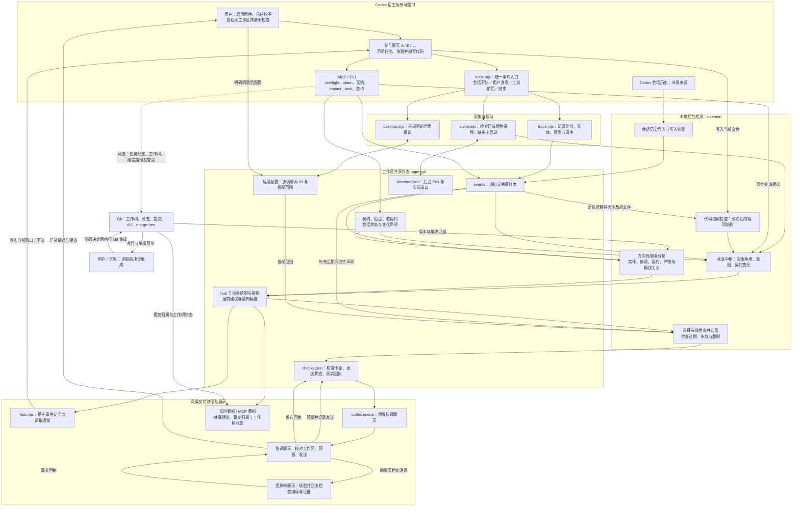
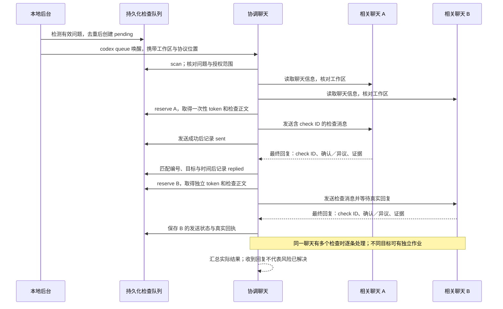

# AgenticGit 系统架构与数据链路

[English](ARCHITECTURE.md) · [文档目录](INDEX.md) · [返回中文 README](../README.zh-cn.md) · [安装与自动协调](USAGE.zh-cn.md) · [方向性影响分析](CROSS-SESSION-IMPACT.zh-cn.md)

本说明对应当前实现，重点解释三个问题：协调事实从哪里来，检测如何形成建议，相关窗口如何收到并回应。README 提供团队协作类比；这里展开组件和持久化协议。

## 系统总图



## 组件职责与代码位置

| 组件 | 输入 → 输出 | 代码位置 |
| --- | --- | --- |
| 统一钩子入口 | 宿主事件 → 按事件顺序调用记录、启动、交付和提议 | [hook.mjs](../plugins/agentgit/scripts/hook.mjs) |
| 事件记录 | 身份、工具、实体、意图 → 追加式账本 | [track.mjs](../plugins/agentgit/scripts/track.mjs) |
| 启用提议 | 工作区与启用记录 → 给 agent 的询问指引 | [desktop.mjs](../plugins/agentgit/scripts/desktop.mjs)、[desktop.ts](../packages/core/src/desktop.ts) |
| 后台启动 | 工作区与端点文件 → 启动或复用后台进程 | [spine.mjs](../plugins/agentgit/scripts/spine.mjs)、[endpoint.ts](../packages/daemon/src/endpoint.ts) |
| 后台循环与看板 | 账本、状态、会话历史 → 派生视图、投影与本地 HTTP 服务 | [serve.ts](../packages/daemon/src/serve.ts) |
| 共享中枢 | 实体争用、意图、租约、契约及代码结构证据 → 共享建议 | [hub.ts](../packages/core/src/hub.ts)、[后台发布器](../packages/daemon/src/hub.ts) |
| 改名代码检查 | 近期任务涉及的支持文件 → 文件级结构指纹与疑似重复对 | [code-duplicates.ts](../packages/core/src/code-duplicates.ts) |
| 方向性影响 | 接收方当前依赖与生产方变化 → 分级影响、交付时机 | [impact.ts](../packages/core/src/impact.ts)、[impact-state.ts](../packages/core/src/impact-state.ts) |
| 模块关系 | 文件导入与仓库线索 → 候选路由与模块依赖图 | [modules.ts](../packages/core/src/modules.ts) |
| 安全点交付 | 已发布投影 + 接收会话 ID → 钩子上下文 | [hub.mjs](../plugins/agentgit/scripts/hub.mjs) |
| 检查队列 | 有效争用、重复结构、紧急影响 → 作业、发送状态、真实回执 | [checks.ts](../packages/core/src/checks.ts) |
| 协调聊天唤醒 | 待处理作业与配置 → `codex queue` 接收结果 | [后台检查派发器](../packages/daemon/src/checks.ts) |
| 跨聊天核验 | 预留作业 → 发消息、等待回复、登记证据 | [coordinate.md](../plugins/agentgit/skills/agentgit/references/coordinate.md) |
| 工具入口 | 明确的查询或状态更新 → core 结果 | [CLI](../packages/cli/src/main.ts)、[MCP](../packages/mcp/src/main.ts) |

本地检测规则不需要模型；协调聊天处理作业、参与聊天核验和解释证据会使用模型。后台没有自行修改业务代码或自动合并的权限。

## 1. 采集：声明、钩子和会话历史

最可靠的写前输入是 agent 主动调用 `agentgit_preflight`，同时提供路径、已知函数名与意图。依赖与版本则通过契约假设、结构化影响状态和变化声明补充。工具返回建议可以立即进入当前聊天。

已信任的钩子负责采集宿主提供的事件；不同事件调用的步骤不同：

| 事件 | 执行步骤 | 用途 |
| --- | --- | --- |
| `SessionStart`、`UserPromptSubmit` | 记录 → 确保后台 → 交付建议 → 考虑启用提议 | 建立上下文、恢复运行、首次询问 |
| `PreToolUse` | 记录；识别为写入的工具再读取建议 | 在待写调用前交付相关提示 |
| `PostToolUse` | 记录 → 交付 → 考虑启用提议 | 安全点更新；补充已运行会话的开启入口 |
| `Stop` | 记录 | 保留会话结束信息 |

识别写入依赖工具名和可解析的路径。Shell 命令的文件作用范围不一定能在写前解析；历史导入及工作树补录是备用路径，观察到的是已经发生的操作。钩子禁用时，历史补录不能替代写前提醒。

## 2. 共享状态：事实和派生结果分开

```text
<workspace>/.agentgit/
├── config.json                  工作区配置
├── events/<机器>-<日期>.jsonl    追加式协调事实
├── contracts/index.json         共享契约版本
└── state/
    ├── leases.json              软租约
    ├── assumptions.json         依赖版本假设
    ├── desktop.json             已记录的协调聊天与启用信息
    ├── daemon.json              后台 PID、端口和根目录
    ├── hub.json                 当前共享建议投影
    ├── impact-protocol.json     选择性影响协议标记
    └── checks.json              授权配置、检查状态与回执
```

账本可以跨会话追溯；投影用于快速读取当前状态。检查队列含真实发送状态和回复证据，不能当作可随意删除的缓存。首次未启用工作区的提议／拒绝记录保存在机器级 `~/.agentgit/offers.json`，避免为了记住拒绝而修改新目录。

本机聊天 ID、绝对路径和回执不应作为通用安装配置发布。分享账本前应检查其中的任务描述与路径。

## 3. 检测：三种证据各有分工

| 检测 | 如何计算 | 结论边界 |
| --- | --- | --- |
| 同实体／同文件争用 | 比较记录的实体、软租约与近期写入声明；同文件声明可跨函数键和文件键汇总 | 工作范围需要协调，不自动证明代码冲突 |
| 重复工作 | 意图词汇相似度；JS/TS 文件的标识符归一化结构指纹 | 意图是启发式；结构相同也不证明运行语义等价 |
| 方向性影响 | 比较变化与接收方实体、依赖、契约假设、产物版本及模块关系 | 输出影响等级、证据和交付策略；证据不足时不能推断破坏性变化 |

共享中枢对同一组输入形成可解释的建议。未能确定重复还是不同工作时，可形成 `ambiguous`，由 agent 使用 `agentgit_hub_resolve` 写入有理由的回答；针对同一争用，最早有效回答作为结论，后续回答不会悄悄覆盖。

结构扫描只处理一小时内活动、状态为 proposed／active／validated 的任务声明的 `.ts`、`.tsx`、`.js`、`.jsx`、`.mjs`、`.cjs` 文件，扫描范围不越出工作区。当前最多考虑 60 个任务、每任务 8 个文件、单文件 128,000 字节、总读取预算 2,000,000 字节，并最多返回 5 对重复候选。指纹样本要求 40–20,000 个 token、至少三个可归一化标识符；模板字符串和存在无法安全识别的斜杠语法时跳过。这些是实现上限，不是可配置检测准确率。

## 4. 交付：安全点上下文与自动跨聊天消息

两条路径可以同时存在，但交付证据不同。钩子读取接收方投影，在宿主事件点注入上下文；跨聊天检查则先持久化作业，由协调聊天完成发送和核验。



新影响协议启用后，跨聊天队列除了紧急方向性影响，还保留有写入证据的同文件争用和代码结构重复检查；纯词汇相似或普通相关更新不会因此自动升级为跨聊天通知。

没有新增有效作业时保持安静。发送不确定或超时不会盲目重发；目标无法映射到真实聊天 ID 时报告路由缺口。授权范围限定在配置的工作区，协调聊天必须核对目标目录。

## 5. 生命周期、去重与恢复

正常状态为 `pending → reserved → sent → replied`。预留 token 将检查编号和目标聊天绑定，阻止中断后重复发送；保存回执需要真实匹配的回复。预留／发送后十分钟仍无核验回复会标记 `timed_out`，匹配的迟到回复仍可登记。

问题失效会标记 `cancelled`；再次出现时获得新的检查编号。唤醒失败有次数上限和退避；被接受但一直无处理进展的唤醒也有有界恢复策略。Windows 状态文件被临时占用时采用有界替换重试，不删除原文件作为降级方案。

后台默认每 2 秒轮询；文件签名变化时重建视图，不变时仍每约 5 秒刷新投影有效性和活动过期信息。每轮检查派发器也检查待处理及超时状态。历史导入默认每 15 秒运行。实际模型处理和宿主调度耗时另外计算，不能把轮询间隔称为端到端送达延迟。

## 6. Git 集成与成果归属

协调可用于普通文件夹。Git 仓库额外提供工作树隔离、任务分支、限定任务路径检查点、提交归属图和集成预览。限定路径提交不会顺手暂存其他文件，但共享同一文件时仍可能混合两位成员的修改，应明确分工或使用独立工作树。

提交归属优先使用 `AgenticGit-Task`、`AgenticGit-Session` 标记，再使用任务分支和账本等回退证据。缺失归属不能通过改写旧提交补造。

`reconcile` 可以读取 Git 信息并使用 `merge-tree` 形成集成预览，可能写入 Git 对象数据库，但不移动分支或修改工作树。预览文本干净不代表行为正确；真实合并由用户／团队决定。

## 验证范围

2026-10-10 的双聊天走查完成两类检查、四份真实回执：同文件争用，以及函数名／变量名改动后的相同结构实现。开启询问的显示仍需要宿主信任钩子；单纯打开文件不会触发原生插件弹窗。机制测试、类型检查与走查验证不同层面的行为，不能相互代替。

运行命令与验证边界见 [实验与验证说明](EXPERIMENTS.zh-cn.md)。每小时心跳是另行选择的只读监控能力；默认自动跨聊天协调使用事件触发的 `codex queue`，不依赖每小时心跳。

## 设计取舍

本地确定性检查放在聊天上下文之外，负责形成有理由的建议；模型用于获得授权后的核验与解释。持久化事实与派生视图分开，避免每次钩子触发都扫描完整历史。未启用工作区的询问记录放在机器级目录，不为了记住拒绝而修改用户项目。

协作检查采用建议机制，保留证据和异议，不强制锁住写入。版本集成由团队决定。固定样例、真实窗口走查和效果测量分别报告，不能把其中一种验证结果替代另一种。
