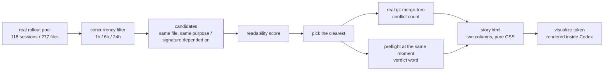

# Experiments: what would make this worth using

**English** | [简体中文](../playground/EXPERIMENTS.zh-cn.md)

This document answers one question: **how do you show, with experiments rather than
assertions, that AgenticGit is worth using — and in a way a reader who does not write code
can follow?**

It contains four things: one analogy that runs through everything, four experiments that each
answer a single sentence, a before/after of one real case, and an honesty floor that is not
allowed to be deleted. Every number here was recomputed by the scripts in this repository.
None of them is quoted from somewhere else.

---

## 1. The analogy: two crews, one house

Think of a multi-agent session as **two construction crews building one house at the same
time.** Each has its own drawings. Each starts work. Neither has a radio.

### Git is a reviewer who arrives after the shift

The reviewer does one thing: lays the two sets of drawings on top of each other and looks for
**lines that land on the same place.**

That is the whole of git's ability here, and it is what makes three kinds of accident
structurally invisible to it:

| Accident | What happened on site | What the reviewer says |
|---|---|---|
| **Both crews painted the north wall** | Crew A wrote "paint the north wall white", crew B wrote "white-paint the north wall" | "The lines don't overlap. No problem." (The work was done twice and one copy is thrown away.) |
| **The plumbing moved yesterday and someone wired to the old drawing** | Crew A rerouted the water main from east to west; crew B ran cable down the east side as drawn | "Not one line overlaps. Perfect, merge it." The house is finished and the first tap opened shorts a circuit. |
| **One crew's half-finished work is swept up by the other's tidy-up** | A finished its shift by plastering over a half-built wall that B had not finished | The reviewer does not look at this. It only compares lines. |

The first two **merge cleanly** and then fail at run time. The third leaves no trace at all.

And the part that decides everything: **the reviewer only ever speaks after the shift ends.**
The accident is named at merge time, when the cost of changing course has already been paid.

### AgenticGit is a foreman who is in the house all day

The foreman does not lay bricks, does not paint, and **does not stop anyone** — that is the
product's safety boundary: it advises, and it never refuses a write. What it holds is one
list: who is standing on which patch of ground right now, when they last moved, and what job
they said they were doing. From that it says one sentence **before** you start.

### The four experiments are four questions you would ask about the analogy

| Question | Experiment | Why an investor cares |
|---|---|---|
| Can the foreman actually see? | 1 · Detection Fidelity (can it see) | If not, everything after this is empty talk |
| How much better does it get if you listen? | 2 · Intervention Impact (does listening help) | This is the "what is it worth" question |
| Does it shout when nobody is there? | 3 · Alert Economy (does it cry wolf) | A foreman who shouts daily is ignored by the second day |
| Could the reviewer have caught this anyway? | 4 · Git Complementarity (could git have seen it) | If git already reported it, the tool is redundant |

In one line: **first that it can see, then that listening helps, then that it stays quiet, and
last that this is not something the reviewer could already have done** — visibility, impact,
restraint, non-redundancy. They are read in that order, because each one is only worth reading
if the one before it held.

---

## 2. The four experiments at a glance

| Experiment | The one-sentence question | The one number | The control that must not move | What counts as failure |
|---|---|---|---|---|
| 1 · Detection Fidelity | On real history, how often does it speak, and how often is it right? | precision and recall (**always reported beside `entityVisibleCeiling`**) | Same file, different purpose must not be refused (`falseRejectionRate`) | Low `recallWithinCeiling` = the detector is broken; low precision = it is manufacturing noise |
| 2 · Intervention Impact | If the agent that was warned obeys, how much better is the outcome? | the drop in duplicates closed on the **obedience 0.5** row | The `untouched` row must be perfect under every arm and every obedience rate | One cell off on `untouched` voids the whole table |
| 3 · Alert Economy | On a day with no collision, how many times a day does it speak? | one advisory per N session-hours, and **zero refusals** | — (this is its own control: the overwhelming majority of "same file" in a real pool is sequential iteration) | So many advisories that they get ignored, or a single refusal |
| 4 · Git Complementarity | For these cases, would git have spoken at the time? | the count of cases with zero conflicts, and the gap between the two timestamps | This is "**different**", not "**better**" | If git really did report a conflict on most of these cases, then these cases never needed AgenticGit |

Four rules run through all four experiments:

1. **Every claim stands next to a control that must not move.** A number without a control is
   a story.
2. **Report the ceiling with the score.** Recall comes with `entityVisibleCeiling` — the part
   an entity-level mechanism structurally cannot reach. Duplicate work stopped comes with the
   independent work stopped along the way.
3. **The all-correct row is arithmetic, not evidence.** "We told it to stop and it stopped"
   demonstrates nothing.
4. **Measure time, not only totals.** The foreman's entire value is in the moment it speaks. A
   number with no timestamp on it is half as convincing.

---

## 3. Experiment 1 · Detection Fidelity (can it see, on real history)

### The question

Across the sessions that **actually happened on this machine**, how often does it speak, and
how often is it right?

### Why the demo cannot be the evidence

The cases in `examples/collision/run.mjs` were chosen by a person. They are readable and
unambiguous. They show the mechanism runs; they do **not** show it is useful in your real
repository. Those are two different claims, and running them together is how you fool
yourself.

### How

1. Scan the real rollout pool on this machine (`~/.codex/sessions`). At the scale of the
   machine this was measured on:

   | | measured |
   |---|---|
   | rollout files | 277 |
   | size | 2.51 GB |
   | distinct sessions | 118 |
   | sessions with file changes | 66 |
   | sessions whose patch bodies can be read | 66 (the rest are not "no collision", they are "cannot be shown") |
   | workspaces scanned | 3 (`repo-a`, `repo-b`, `repo-c`) |

   Re-running this a few hours later, to write this document, read 278 files and 119 sessions
   — because producing the document recorded its own session into the pool. The pools below
   were unchanged by that (still 83 / 26 / 11 / 4), which is the expected shape: one more
   session with no shared file adds nothing. So the numbers are dated, not timeless, and the
   command to re-derive them is in §9.

2. **Replay the real transcripts into the ledger** (`adoptSession`), on their real timestamps,
   with no simulated time.
3. Decide mechanically whether "two sessions are doing the same thing" using the **patch
   bodies** — the `*** Update File:` / `*** Add File:` sections of `apply_patch` in the
   rollout. This step is what makes the experiment stand up: **it puts the criterion in a
   machine rather than in my judgement.** Otherwise "I think these two are duplicating each
   other" becomes an input to the experiment.
4. Run it at concurrency windows of 1 hour, 6 hours and 24 hours, scored with
   `evaluatePack()` in `packages/core/src/e2.ts`.

### The one number

Precision and recall, **always reported beside `entityVisibleCeiling`**. The ceiling is a
property of the mechanism, not of the detector: a collision that shares no entity with
anything in flight is, in principle, out of reach for entity-level matching. A recall figure
reported without its ceiling gets compared to 1.0 and produces a confident, wrong conclusion
that "it isn't accurate".

### The control that must not move

Same file, different purpose (`independent`) **must not be refused.** Being flagged is
acceptable — a flag costs attention. Being refused is not — a refusal costs the work itself.
This is why the figure reported is `falseRejectionRate` and not `falseAlarmRate`.

### The trap the report must name

Naively counting "same file" produces **83 episodes**, and the overwhelming majority of them
are **one developer iterating on one file across days** — for example three sessions in
`repo-a` on consecutive days, all editing the same file. That is sequential, not concurrent
duplicate work. Calling those collisions is exactly the false positive `e2.ts` refuses to
count.

**After the concurrency filter, the real distribution:**

| Window | Cross-session same-file pairs |
|---|---|
| 1 hour | 4 |
| 6 hours | 11 |
| 24 hours | 26 |
| unbounded (the naive count) | 83 |

The window is itself part of the finding: **how rare "two agents doing the same thing at the
same time" is depends on how wide you draw "at the same time".** Going from 1 hour to 24 hours
multiplies the count by 6.5, and removing the window entirely reaches 83 — **twenty times the
1-hour figure, and nearly all of the extra is sequential work.** So all three windows get
reported and the single-window number is never given alone.

One layer further in: of those 83 pairs, only **20 have a readable patch body on both sides** —
the pairs that can actually be put in front of a reader. The other 63 are not "no collision",
they are **unprovable**, and a report has to keep those two apart: merging them into one number
is quietly counting "cannot see" as "did not happen". Of the 20, **4** are inside a real git
repository and are source code.

### A real duplicate, picked up in passing (not staged)

The top-ranked case in the pool needs no scoring sophistication to understand:

| | |
|---|---|
| The two sessions | `session-a` and `session-b` |
| The instruction | the same sentence, word for word: *summarise this into a document, with an extremely detailed review …* (**paraphrased**) |
| Gap between them | **107 seconds** |
| Each wrote | 1062 lines and 542 lines, into the same `.zh-cn.md` file |
| Workspace | `repo-b` — **which is not a git repository** |

Intent similarity 1.00. This is the letter of "both crews painted the north wall": one
instruction given twice, two agents writing files of nearly a thousand lines each, and one of
the two necessarily discarded. And here there is **not even a repository**, so the question
"would git have found this" cannot be asked at all — which is precisely the part experiments 3
and 4 exist to measure and this paragraph may not claim.

### What counts as failure

- Low `recallWithinCeiling` → the detector is broken (it did not see what it could have).
- Low precision → it is manufacturing noise (it said things it should not have).

---

## 4. Experiment 2 · Intervention Impact (does listening help)

### The question

If the agent that was warned obeys, how much better is the outcome?

### How

Reuse the existing paired A/B (`examples/ab/run.mjs`): one set of scenarios, run under four
arms. Obedience is a **dial** (0 / 0.5 / 1), not an assumption. All four arms share **the same**
obedience pattern — it is a paired design, otherwise what the arms compare is luck, and one
extra "obeyed" draw out of six moves the result by a sixth.

### The one number

**The drop in duplicates closed on the obedience 0.5 row.** That is the only row carrying
information: the fully obedient row is arithmetic, the zero-obedience row is the floor, and
only the middle row tells you what one advisory is worth.

### The control that must not move

**The `untouched` row must be perfect under every arm and every obedience rate.** That is the
floor for "a detector may not fire on ground nobody is standing on". If it moves by one cell,
the duplicate-work column can no longer be interpreted.

### The cost that has to be read beside it

**`independent stopped`**: rounds that were minding their own business and were talked out of
it. What the product says there is REPLAN — split the entity, or agree an order — which is a
**deferral, not a loss**. It still has to be printed next to the duplicate column, because a
tool that eliminated duplicates by stopping everything would look identical on that column
alone.

### The honesty floor (this experiment currently yields no effect size)

The fully obedient row is arithmetic, not evidence. **The obedience rate of a real agent has
not been measured**, and only that number turns the difference into an effect size. Until it
is measured, experiment 2 can claim "the mechanism works and the arms differ" and cannot claim
"it improves outcomes by X%".

---

## 5. Experiment 3 · Alert Economy (does it cry wolf)

### The question

On a day when nothing collides, how many times a day does it speak?

### Why this is the page an investor should read

This is what kills adoption. **A foreman who shouts "wolf" every day is ignored on the
second.** Between a tool with 95% precision that speaks 200 times a day and one with 70%
precision that speaks twice, the second one is the one that gets kept.

### How

Count advisories per session-hour over the real pool, and count the two kinds **separately**:

- **advisory**: look at it, you may ignore it, the cost is attention.
- **refusal**: the write is stopped, the cost is the work itself.

The product never refuses, so under a correct implementation the second count must be zero.
That is not a slogan — it is **an assertion an experiment can falsify**: `action` is `'none'`
in `PRODUCT_POLICY`, so any non-zero refusal count is a bug rather than an inevitability.

### The one number

**One advisory per N session-hours, and zero refusals** — and, as in experiment 1, reported
separately at the 1h / 6h / 24h windows.

---

## 6. Experiment 4 · Git Complementarity (could git have seen it)

### The question

For these cases, would git have spoken at the time?

### How

Only over a **real git repository** (of the three candidate workspaces on this machine, only
`repo-a` is one; `repo-b` and `repo-c` are not). The repository is **cloned to a temporary
directory and the source repository is read-only.**

For one pair of real sessions:

- take the conflict count from `mergeTreePreview()` (underneath, `git merge-tree --write-tree`);
- put it beside AgenticGit's verdict at **the same moment**;
- measure the gap between two timestamps: **the moment AgenticGit speaks, before the write**,
  against **the earliest moment git could possibly speak** (a merge — and a merge cannot be
  earlier than both sides being finished).

### The one number

**How many cases have zero conflicts, and the time gap.** The first answers "would the
reviewer have seen it"; the second answers "and even if it had, how late was it".

### The control that must not move

This is "**different**", not "**better**". The report has to say that git and AgenticGit are
**not doing the same job**: git is an after-the-fact merge check based on textual overlap,
AgenticGit is before-the-fact coordination based on intent and contracts. **Until the real pack
exists, no claim is made that it is better than git.**

### What counts as failure

If git really did report a conflict on most of these cases, then those cases never needed
AgenticGit. When that happens, change the case — **not the wording.**

---

## 7. This round's deliverable: the before/after of one real case

The four experiments are the method. To get a developer and an investor to nod **inside one
screen**, what is needed is a side-by-side of one real case: on the left the reviewer saying
"no problem", on the right the foreman saying "hold on".

**Why not use the 107-second real duplicate at the top of the pool?** Because its workspace is
not a git repository, so the left-hand column has nothing to ask and the "before/after" becomes
"blank on the left, a warning on the right" — the reader can only take our word for it. So the
material for this screen is one of the 4 candidates from §3 that **are inside a real git
repository with readable patches on both sides**. The count of real duplicates stays in
experiment 1. The two are not mixed.



### How to run it

```bash
node examples/real/cases.mjs        # scan the pool: candidate list and the three windows
node examples/real/run.mjs          # pick one real case, build the before/after report
node examples/real/run.mjs --list   # list candidates only, ranked by score and reason
node examples/real/run.mjs --pick 2 # a specific one, even if it is a "did not see it" case
node examples/real/run.mjs --keep   # keep the temp repository, so the two branches can be checked
```

`run.mjs` prints a content token at the end. Paste the whole line into a Codex reply and the
report is rendered inside the conversation.

### Two reconstruction routes, and the report must say which one it used

How the two agents' own versions of the file were obtained decides how much weight the words
"0 conflicts" can carry. So the script tries **anchored** first: if some committed revision
accepts both patches, the two branches are "that revision plus each side's own bytes".

When that does not apply — and this repository is such a case, because both sessions wrote into
an **uncommitted working tree** and the developer committed them in a batch hours later — it
falls back to **reversed**: take the commit that **holds both changes**, **remove the other
side's change** from it, and what remains is this side's version. That route has to pass a
check: apply both patches **forwards** to the inferred base again and require the two versions
to come back line for line. If it fails, the reconstruction is declared unavailable, and that
column of the report reads "unavailable" rather than showing a conflict count.

The reversed route carries a **selection effect the report must state**: reverse removal can
only succeed when the two changes occupy **non-overlapping** regions of the file. So on that
route a clean merge is **the expected result rather than a surprise finding** — it is the answer
for **this pair**, and it cannot be used as a rate for "how blind git is". The rate is what
experiment 4 counts over the pool.

### What the report has to contain

- Left: the real output of `git merge-tree`. For this case it is **a clean merge, 0 conflicts**,
  and the two changes are **5 lines apart** — inside the same argparse argument block.
- Right: AgenticGit's verdict word at the same moment, the reason, and **the instruction text
  the other session's ledger was carrying at that time, verbatim**.
- A time gap: how long ago the other side last wrote.
- A timeline: **the two changes landed in the same commit 7 minutes 29 seconds later** — that
  is, git never had a merge to judge.
- An honesty strip at the bottom: this is **one** case, not a rate; a clean merge is not
  correct behaviour; we do not claim to do what git does; the verdict reads "the user's last
  sentence" rather than "what the agent is doing", so it will miss things when the words are
  thin — and that is what experiment 1 measures.

Something the report may also include, when the caller supplies it: the merge those two
branches finally ended in, if they ever met. That is asked for with `--refs A,B` and is off by
default, because which refs a repository's divergence ended in is a fact about that repository
and there is nothing sensible to guess.

### Sandbox constraints (learned the hard way, and mandatory)

The session sandbox that hosts an inline panel **silently** blocks a great deal, and the symptom
is a permanently blank table rather than an error. So the report:

- **must contain no `<script>`**, and no `fetch` / `XMLHttpRequest` / `WebSocket` / `EventSource`;
- is served under a CSP that allows only a short list of CDNs;
- uses **pure CSS** for interactivity (`:checked` plus a sibling selector) or a native
  `<details>`;
- never has its content token **written by hand** — it is wrapped in two private-use code
  points, and one wrong code point renders as garbage. It is produced by `panelReference()`.

### The honesty gates

Two gates, both of which make the script **exit non-zero** and print, one by one, why each
candidate was rejected:

1. **No candidate qualifies** (not in a git repository, or one side's patch cannot be read).
2. **A candidate qualifies, but the product's verdict for it is `allow`** — the product staying
   silent is a **finding**, not a demo. Silence belongs in experiment 1's count, not in a
   one-screen before/after.

A missing patch, an undecidable intent, a reconstruction that fails forward verification — each
one is printed with its reason. **A fake case is never staged to fill the gap.**

---

## 8. The honesty floor (not allowed to be deleted)

Printed in every report:

1. **The obedience rate of a real agent has not been measured.** The fully obedient row is
   arithmetic, not evidence.
2. **Until the real pack exists, no claim of being better than git.** Only that git
   structurally cannot see this and we saw it at the moment of the write.
3. **With no qualifying real case, exit non-zero.** A fake case is never staged.
4. **Anything derived statically rather than by running is labelled "static evidence, not
   executed".** For example "this would blow up if both agents finished" — that is reasoning,
   not observation.
5. **Recall is always reported with `entityVisibleCeiling`; duplicate work stopped is always
   reported with the independent work stopped along the way.**
6. **Every number must be traceable to a specific case.** A claim that cannot be pointed back
   at the original record is not a claim, it is an impression.

---

## 9. How to reproduce

```bash
npm test                        # unit tests
npm run test:py                 # the Python ledger analyser, against the same fixtures as TS
npm run typecheck
node scripts/strip-bom.mjs --check
node examples/real/cases.mjs    # the pool numbers of experiments 1 / 3 / 4
node examples/real/run.mjs      # the before/after report of §7
node examples/ab/run.mjs        # the paired A/B of experiment 2
```

`cases.mjs` takes its scope from the transcripts: the workspaces it reports on are every
directory the sessions recorded, not a list kept in the source. `--workspaces a,b` (or
`AGENTGIT_SCAN_WORKSPACES`) narrows it, which is worth doing when the pool contains scratch
directories. `run.mjs` takes the same flag, and `--refs A,B` for the final-merge block of §7.

---

## 10. Redactions

This document is published publicly, and its numbers come from real sessions on a real
machine. Those two facts are reconciled by **replacing the identifiers, keeping the numbers,
and stating here what was replaced.**

Replaced:

| In this document | Stands for |
|---|---|
| `repo-a` | the only one of the three workspaces with history that is a git repository |
| `repo-b` | the workspace with the most sessions (40), which is not a git repository |
| `repo-c` | the third workspace with history, which is not a git repository |
| `session-a`, `session-b` | the two sessions in the real duplicate of §3 |
| the instruction text in §3, marked *paraphrased* | a sentence that was identical in both sessions, reproduced here in English as a summary rather than word for word |

Removed entirely: the name of the remote branch the two real branches finally landed on. It is
a repository-specific identifier, and §7 now takes the two refs as a `--refs` argument that is
off by default, so nothing in this repository depends on it.

**Every number in this document was computed from the original data before any of the above
replacement.** The substitution touched identifiers only and moved no value: 277 files, 118
sessions, 2.51 GB, 66 sessions with patches, 83 naive pairs, 26 / 11 / 4 at the 24h / 6h / 1h
windows, 20 provable pairs, 63 unprovable, 4 in a real git repository and source code, the
107-second gap, 1062 and 542 lines, similarity 1.00, 5 lines apart, 7 minutes 29 seconds, and
the verdict `replan`.

The mapping from `repo-a`/`repo-b`/`repo-c` and `session-a`/`session-b` back to the original
identifiers is held locally by the author, and anyone who wants to verify a number against its
source case can ask for it. §9 lists the commands that recompute each one.
