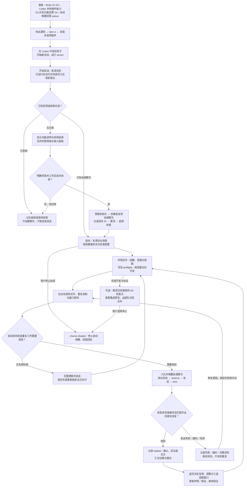

# AgenticGit 使用说明

[English](USAGE.md) · [返回中文 README](../README.zh-cn.md) · [文档目录](INDEX.md)

本说明统一介绍安装、首次授权、自动检查、日常操作与检测限制。组件实现见 [系统架构](ARCHITECTURE.zh-cn.md)，验证方法见 [实验与验证](EXPERIMENTS.zh-cn.md)。

## 安装

需要 Node 22.19+、Git，以及支持本地插件、钩子和跨聊天工具的 Codex 桌面端。
自动唤醒还需要本机 Codex CLI 的 `queue` 子命令，Codex 应保持运行并已登录。

```sh
git clone https://github.com/yiweiqin/agentgit.git
cd agentgit
npm ci
node packages/cli/bin/agentgit.mjs install
codex plugin add agentgit@personal
node packages/cli/bin/agentgit.mjs install --enable
node packages/cli/bin/agentgit.mjs doctor --workspace <工作区绝对路径>
```

若安装器输出的 marketplace 名称不是 `personal`，使用它输出的安装命令。
安装器会生成适合本机的 Node、源码、钩子和 MCP 路径。保留检出目录，插件运行时会使用它。
安装后在 Codex 中批准钩子信任，再开始新会话。这不是 npm 发布包，不要使用 `npx agentgit`。

下面的 `agentgit ...` 是简写：可选执行 `npm link` 将命令加入 PATH；未链接时，在源码目录使用
`node packages/cli/bin/agentgit.mjs ...`。协调其他目录时传 `--workspace <绝对路径>`。
卸载使用 `node packages/cli/bin/agentgit.mjs uninstall --disable`。

## 首次启用

在尚未启用的工作区开始会话，插件询问是否启用、创建专用协调窗口，并允许它通知同一工作区
的相关聊天检查冲突和接口变化。同意后，当前聊天执行
[setup.md](../plugins/agentgit/skills/agentgit/references/setup.md)：

1. 检查工具能力、原生 Codex 可执行文件和项目目录。
2. 预留初始化流程，防止同时创建两个协调窗口。
3. 创建并置顶 `AgenticGit — <工作区名>`，立即记录聊天 ID，以便中断恢复。
4. 配置自动检查、启动守护进程，验证健康接口和启用状态。
5. 通知协调窗口开始扫描；以后有可处理变化时由守护进程唤醒。

当前宿主没有“打开文件或选中文件夹”的钩子事件，**仅打开文件／选中文件夹不能立即弹出提示**；实际入口是
开始会话或提交用户消息，已运行会话还可在完成写入后收到提议。钩子会指引 agent 在宿主支持时
使用带功能说明和启用选项的输入面板；它不是插件直接创建的原生窗口。普通文件夹可用，提交图需要 Git。若目录尚未成为 Codex 项目，
需先添加项目。宿主缺少跨聊天工具或 `queue` 时会明确报告限制。

拒绝后不创建聊天，也不向未启用目录写入 `.agentgit`；决定记在 `~/.agentgit/offers.json`。
忽略的提议有七天冷却时间，明确拒绝不会定期重问。

## 运行链路

会话启动、用户提交消息、准备修改争用文件时，已信任的钩子注入共享裁决。守护进程观察
账本和接口变化，把检查写入 `.agentgit/state/checks.json`，用官方 `codex queue` 唤醒协调窗口。
协调窗口遵守 [coordinate.md](../plugins/agentgit/skills/agentgit/references/coordinate.md)，
验证目标工作区、预留检查、发送消息、等待带检查编号的真实回复，再保存回执并汇总。

正常过程是 `pending → reserved → sent → replied`；失败、超时和问题消失分别记录为
`failed`、`timed_out`、`cancelled`。同一未消失问题不会重复创建检查。预留后十分钟无核验回复
则超时，不盲目重发；迟到的真实回复仍可登记。协调窗口自身唤醒失败最多重试三次。
收到回复只表示对方回答了，异议和“与我无关”同样保留，不等于冲突已修复。

无钩子信任时，会话历史导入只能观察已经发生的修改，不能提供写前保护。插件不能自行绕过
Codex 的信任确认。裁决是建议，不会强制拦截写入。自动检查不会自动合并、重置历史或修改
业务代码，也不会向其他工作区发送检查。唤醒聊天会使用模型调用，不额外创建每小时自动任务。

## 两个窗口的实际使用例子

| 场景 | 参与窗口怎么做 | 协调窗口怎么检查 |
| --- | --- | --- |
| 两人改同一份文件 | 两位 agent 分别声明路径和意图；知道函数名时同时给出路径和符号 | 汇总近期写入声明，包括“一个声明函数、另一个声明文件”；分别向相关聊天发送检查 |
| 不同命名的重复实现 | 两位 agent 在不同 JS/TS 文件写出相同结构，函数和变量名不同 | 以支持文件的结构指纹提供证据，让两个窗口只读核验是否应复用 |
| A 改接口、B 使用旧版本 | A 发布接口变化；B 记录使用的版本与依赖 | 基于契约和依赖证据选择接收方，避免向所有窗口广播 |

参与窗口收到含 `check-...` 编号的消息后，只读核验并在最终回复中保留编号、确认或异议、证据和建议。
无需向其他聊天再次发消息，协调窗口会读取并登记回复。普通工具返回的 `REPLAN` 等建议和后续收到的跨聊天消息是两种交付证据，不能混写成“已自动通知”。

2026-10-10 的双聊天实测已核验同文件和改名结构两类检查，分别向两个参与窗口送达并保存回执。
代码结构检测的文件类型、扫描上限与跳过情形见 [架构说明](ARCHITECTURE.zh-cn.md)，不代表通用代码语义等价检测。

## 按链路定位故障

| 症状 | 先核对什么 | 如何判断恢复 |
| --- | --- | --- |
| 没有首次启用询问 | 插件是否启用、钩子是否信任、是否已拒绝或已有协调记录；有没有实际触发会话事件 | 新会话／消息事件中得到提议；不能用仅打开文件验证 |
| 预检有提示，却没有自动消息 | `checks status` 是否启用、协调聊天 ID 是否有效、后台是否运行 | 队列出现有效作业，协调聊天实际开始核验 |
| 后台启动或唤醒失败 | `daemon.json` 中 PID、实际端口与健康接口；原生 Codex 路径及 `queue` 能力 | 健康检查成功；唤醒被接受后还需核对协调聊天实际执行 |
| 只有 `pending` 或 `reserved` | 路由、授权范围、协调聊天是否运行、发送是否不确定 | 明确成功发送后才记 `sent`，不能猜测已送达 |
| 已 `sent`，没有回执 | 目标聊天是否在等待输入、回复是否带正确编号、是否超过十分钟 | 匹配的真实回复登记为 `replied`；超时不能当作成功 |
| 相同代码没有提醒 | 是否属于近期声明的支持文件、是否符合样本规模、是否因语法跳过 | 查看结构证据；未提示不证明没有重复 |

钩子自动启动时绑定随机可用端口；手工启动且没有已有后台时默认使用 7777，`up` 也可能复用其他端口的后台。
读取 `daemon.json` 中的实际端点，不能把 `localhost:7777` 当作所有工作区固定地址。

## 查看、停止与恢复

在检出目录运行以下命令，将 `<folder>` 替换为受协调工作区的绝对路径：

```sh
node packages/cli/bin/agentgit.mjs checks status --workspace <folder>
node packages/cli/bin/agentgit.mjs checks disable --workspace <folder>
node packages/cli/bin/agentgit.mjs desktop --clear-init --workspace <folder>
```

停止会保留回执。恢复时让当前聊天遵循 setup.md，复用已记录的协调聊天。
`--clear-init` 只清除未启用文件夹的机器级询问记录，不会清除已有协调窗口或重新启用检查。
不要通过删除协调记录和检查队列来尝试恢复。
`.agentgit/state/spine.log` 和 `daemon.json` 用于诊断守护进程。
`/agentgit` 仍是“启用记录并置顶当前聊天、打开面板”的快捷入口；自动消息需要上述明确同意。

## 数据与发布

本机聊天 UUID、可执行文件路径和检查回执保存在 `.agentgit/state/`，不应发布。
共享账本可能含任务描述和文件路径，推送 `.agentgit/events/` 前请检查内容。
生成的 `.mcp.json`、`spine.json`、`hooks.json`、`hooks/hooks.json` 含绝对路径，应在安装时生成。
代码仓库提供模板和测试，使用者无需复用开发者的聊天、目录或自动任务。

## 使用流程细节



开启询问以**工作区**为单位，不是每开一个文件都弹窗。当前宿主没有“打开文件／选中文件夹”钩子；入口是会话开始、提交消息，或已运行会话的完成写入事件。选择框依赖宿主能力和 agent 对钩子指引的执行，不是插件自行创建的原生窗口。

正常检查状态为 `pending → reserved → sent → replied`。队列接收成功不等于检查完成；收到回执不等于风险已解决。异常状态为 `failed`、`timed_out`、`cancelled`。具体含义见上文“运行链路”。


## 日常操作

| 目的 | CLI 简写 | 对话工具／入口 |
| --- | --- | --- |
| 查看协调状态 | `agentgit status` | `agentgit_status` |
| 写前声明路径、函数、意图 | `agentgit preflight` | `agentgit_preflight`；知道函数时同时传 `path`、`symbol` |
| 声明／释放工作范围 | `agentgit preflight --claim` / `agentgit lease release` | `agentgit_claim` / `agentgit_release` |
| 发布接口、记录依赖版本 | `agentgit contracts publish` / `agentgit contracts assume` | `agentgit_publish_contract` / `agentgit_assume` |
| 声明变化和依赖、检查影响 | `agentgit impact` | `agentgit_impact_state` / `agentgit_impact_publish` / `agentgit_impacts` |
| 查看提交归属与实时看板 | `agentgit graph` / `agentgit up` | `agentgit_ui` |
| 查看自动检查和回执 | `agentgit checks status --workspace <目录>` | 协调聊天核验真实回复 |
| 查看集成顺序与预览 | `agentgit reconcile` | `agentgit_reconcile`；实际集成由用户决定 |
| 查看模块依赖 | `agentgit modules [<模块>]` | `agentgit_modules` |
| 任务分支、检查点与结束 | `agentgit task start` / `checkpoint` / `finish` | `agentgit_task` |
| 查看或调整参数 | `agentgit config` / `config <设置> <值>` | CLI；完整命令语法见 `agentgit help` |
| 停止自动协调 | `agentgit checks disable --workspace <目录>` | 保留历史与回执 |

`/agentgit` 是启用记录、置顶当前聊天和展示面板的快捷入口；自动跨聊天检查另需明确授权。

| 写入前建议 | 含义与行动 |
| --- | --- |
| `allow` | 未发现当前声明范围内的争用，可继续写入 |
| `reuse` | 可能已有相同工作，检查是否可以复用 |
| `refresh` | 所依赖版本已变化，重新读取再适配 |
| `replan` | 范围重叠，调整分工或约定顺序 |
| `wait` | 依赖尚未落地，按已发布接口设计或等待 |
| `review` | 存在需要人工决定的风险，先审查再继续 |

插件不强制阻止写入。任务检查点只暂存该任务记录的路径，并写入 `AgenticGit-Task`、`AgenticGit-Session` 标记；已有提交不会为了增加归属而改写。共享同文件仍需明确分工，必要时用独立工作树隔离。

提交图优先读取提交标记，再参考任务分支、账本与聊天名称，缺失时回退到编号或 Git 作者。
回退名称不等于已经记录的聊天归属；可用 `agentgit graph --explain <提交或任务>` 核对证据。

## 检测范围与边界

| 场景 | 证据与通知 | 当前边界 |
| --- | --- | --- |
| 两窗口改同文件 | 近期写入声明，支持“函数声明与文件声明”交叉识别 | 证明范围重叠，不单独证明文本冲突或写入成功 |
| 不同文件实现相同功能、名称不同 | 近期任务涉及的 JS/TS 文件：标识符归一化与结构指纹 | 文件级结构比较；不是通用语义等价分析 |
| 相似任务描述 | 意图词汇相似度和共享实体 | 启发式信号，可提出异议；不能覆盖所有不同措辞 |
| 接口变化影响其他任务 | 契约、假设、显式依赖、产物及模块关系 | 普通写入事件不足以证明接口破坏 |
| 成果来自哪个聊天 | 提交标记、任务分支、账本及会话名称等回退证据 | 归属来源明确标注，推测不能当成记录事实 |

结构扫描保留字面量、运算符、成员调用及部分标识符关系，有任务数、文件数、体积与 token 数上限；过短样本、模板字符串和无法安全识别的斜杠语法会跳过。没有提醒不能证明没有重复工作。通知不替代测试、代码评审或 Git 集成检查。

